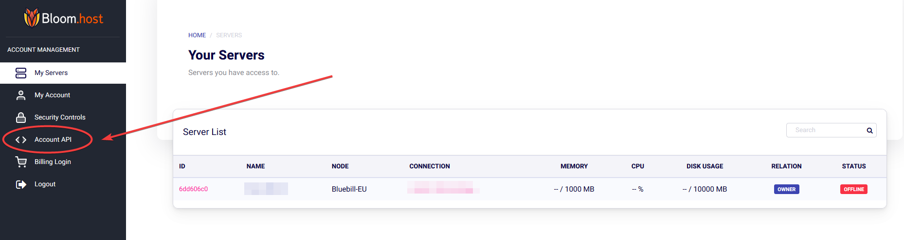

# SRVControl

Hey Bloomers! In this guide we will be going over how to connect SRVControl (Discord Bot) to your Minecraft servers hosted on Pterodactyl. This discord bot uses the pterodactyl api to allow you to control your servers through discord.

We can start by heading over to their [website](https://srvcontrol.xyz/) and inviting the bot to your discord server. Then once you are on the SRVControl dashboard, click manage on the server you invited the bot to and set the **Panel URL** to https://mc.bloom.host. You can change the other settings if you please, but this is all that is required to get the bot to work.

After we have done this, we now want to create the API Key that SRVControl can use to access your servers. To do this, simple head over to the [panel](https://mc.bloom.host/) and once you are logged in, click **Account API** on the left.


Then click **Create New** and give it some relevant description that you will remember what it is for. Do not put anything in allowed ips as SRVControl does not state the ip address used for their bot. Once you are done, click **create**. Now there will be a list of API keys, in your case there will only be one so just click the key icon to reveal the long key and copy it. Please keep this key secure as anyone with this key can access any servers on your account. SRVControl is a reputable discord bot so I would trust them.

After inviting it to your server with the proper permissions, go to that discord server and type ```.register``` in one of the channels. This will initiate the API key registration. The bot will DM you asking for your api key and be aware you only have 60 seconds to send it, so just paste it and send it. This will complete the API registration and you should receieve a **"Success"** message if you followed this documentation correctly.

Now, back in your discord server you can do type ```.help``` by default (if you did not change the prefix in the SRVControl dashboard) to show you all the commands you can do which interacts with your server.
