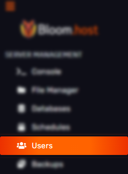

# Subusers

### What are subusers?
> People such as server's staff members can be given partial, so called "sub-user" access to the game panel. 

### Adding subusers
>
> First, head over to the [Duck Panel](https://mc.bloom.host/) and go to the Users tab found on the left sidebar. Here you can manage all your subusers. Now, click `Create New` button to begin setting up a subuser. 
>
> 

> Simply enter the person's email account. Then, select which permissions you want to grant the user. You can select all permissions or clear the permissions.
> 

> Once you have clicked add user, an email will be sent to that email stating they have been invited to that server. Have the sub-user open up the email and go to the link provided.
> 

> After clicking the button in the email, they will be redirected to the password reset page. This is where they will put in your email and setup a password for your account.
> 

> After setting up your account, go to the [Duck Panel](https://mc.bloom.host/) and log in with your freshly generated credentials!
> 

---