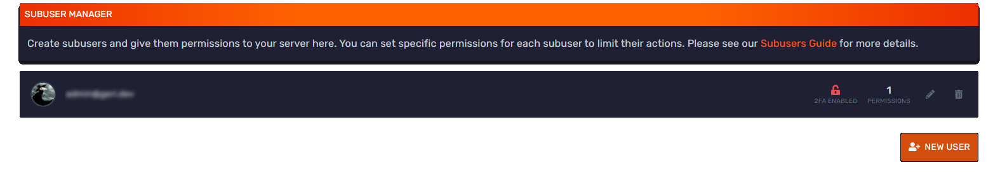

# Subusers
Hey there Bloomers! In this guide, we will go over how to add subusers to your panel.

Head over to your panel and go to subusers tab found on the left sidebar. Here you can manage all your subusers. Now, click **Create New** button to begin setting up a subuser. 

Once you have entered, enter the person email account. Then, select which permissions you want to grant the user. In the Blue Box, you can select all permissions or clear your permissions. In the yellow box, you can add the subuser, which will send the email to them.

Once you have clicked add user, a email will be sent to that email stating they have been invited to that server. Have the sub-user open up the email and go to the link provided.

Once you have clicked on the email, you will be redirected to the password reset page. This is where you will put in your email and setup a password for your account. Once you are done, hit **Reset Account Password** and then login to your account with the credentials you have setup.
