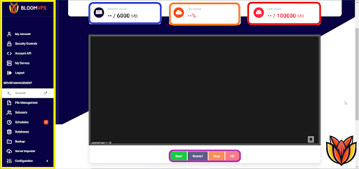
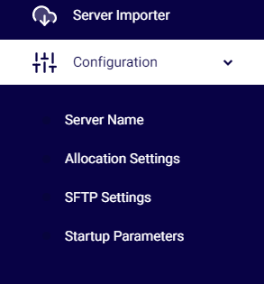

# Basic Controls

Hey there Bloomers! This guide will help you understand your panel environment and what everything means.

Blue is the memory usage your server is using. With Akair flags, you will be using most of this. Unused memory is wasted memory!

Orange is the CPU usage between your two cores. Minecraft Paper will only utilize 2 cores, meaning, having more doesn’t mean better performance. If you wish to have more, consider getting a VPS.

Red is the disk space that you have used. Plugins that store a lot of data such as Dynmap may take up lots of storage, so it’s recommended to keep an eye on the amount of storage you have left. If you reach the maximum amount of storage, your server will shut down and wait until you have enough storage to restart again.

Gray is the console. In here, you can send any command and see what everyone on your server is doing. When launching a command, remember to remove the /. If you still want to use a /, consider [this](https://www.spigotmc.org/resources/81157) plugin.

Purple is the server control menu, allowing you to start, stop, and restart your server. It is not recommended to kill your server as plugins and worlds won’t save and may become corrupted. Only use it if your server becomes unresponsive.

Yellow is the sidebar, which allows you to flip between different tabs on your panel. These range from control panel accounts to manage your databases. If a tab has an arrow on it, it is a category with multiple different tabs hidden under it. To see those tabs, click on the category to open up the available tabs.

