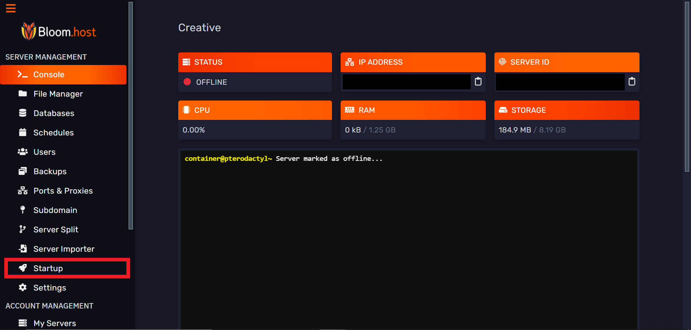
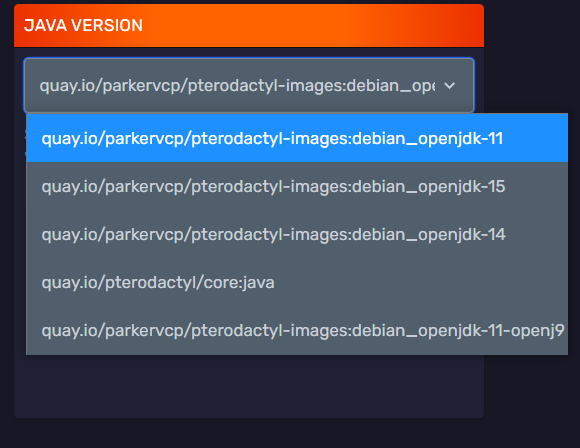

# Change the version of Java that is used on your server

Bloom.host offers different versions of Java to suit your server. The default Java 11 (8 for Forge servers if you specified that when purchasing your server.) will suit most people.
This guide will show you how to change the version of Java if it does not work for your server.

:::note
PaperMC have announced that they [will be dropping Java 8 support when Minecraft 1.17 releases.](https://papermc.io/forums/t/java-11-mc-1-17-and-paper/5615)
:::
# Changing the Java version

:::caution
Make sure that you have [stopped your server first.](https://docs.bloom.host/basic-controls)
:::

Firstly you want to go to the [Minecraft server control panel](https://mc.bloom.host/) and select the server that you want to change the Java version of.

Secondly, navigate to the startup tab on the sidebar on the left.

Next, find the Java Version tab (usually on the top right of the page)

:::important
If you are unable to change this next setting and you see a message such as "This server's Docker image has been manually set by an administrator and cannot be changed through this UI.", please [open a ticket on the support Discord.](https://discord.com/invite/bloom) and Bloom.host staff will need to change this for you.
:::

:::caution
The OpenJ9 image is **not** recommended for Minecraft servers, you should be using hotspot (the other Java images) instead!
:::

You should be able to change the Java version to a version of Java you need. In this image you can see that we can change between these versions:
 * Java 8 (`quay.io/pterodactyl/core:java`)
 * Java 11 (`quay.io/parkervcp/pterodactyl-images:debian_openjdk-11`)
 * Java 14 (`quay.io/parkervcp/pterodactyl-images:debian_openjdk-14`)
 * Java 15 (`quay.io/parkervcp/pterodactyl-images:debian_openjdk-15`)
 * Java 11 OpenJ9 (`quay.io/parkervcp/pterodactyl-images:debian_openjdk-11-openj9`)

Simply change this to the version of Java that you need and then restart the server.
You have successfully changed the version of Java your server uses.
