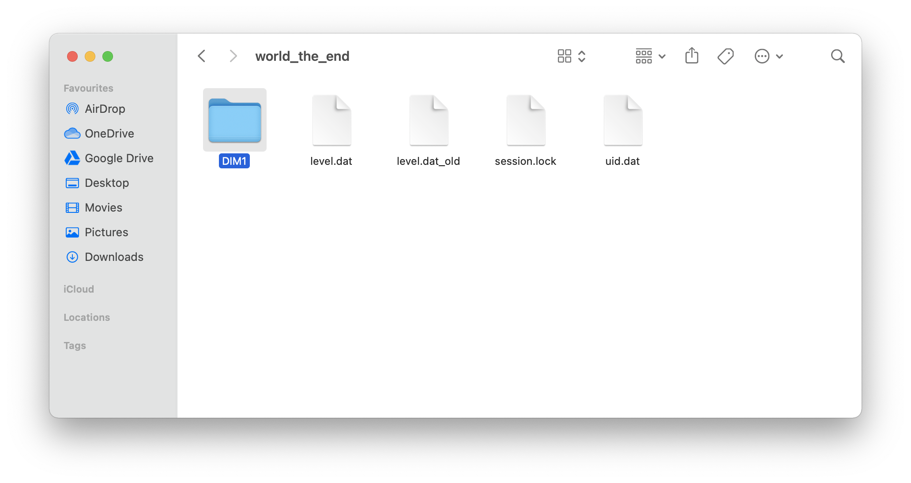
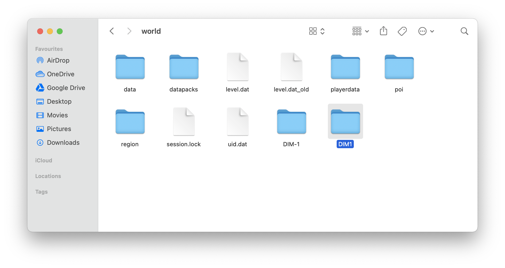

# Converting Bukkit Worlds to vanilla
If you upload or generate a world on a Bukkit/Spigot/Paper server, you will notice that when the server loads it splits the world into three folders: `world`, `world_nether` and `world_the_end`, or one for each dimension. This is fine until you want to download the world and run it in singleplayer or switch to a vanilla/Fabric/Forge server. This guide shows you how to convert Bukkit/Spigot/Paper worlds back to ones that can be used on vanilla or other server types. Note that the screenshots provided were taken on macOS, but the method should work for all platforms.

## Part 1: Download the world
**Note:** This is not strictly necessary, you CAN use SFTP or the file manager if you want, but downloading the files makes them much easier to work with.

This is most easily done by archiving the files using the Pterodactyl file manager and downloading them using SFTP. For instructions on using the file manager and SFTP, please see [File Manager Controls](file-manager-controls.md) and [How to use SFTP](how-to-use-sftp.md), respectively.

## Part 2: Converting the world

Once you have downloaded and extracted your archive from the server, you should have three folders that look like  this:

In this guide, we will be referring to the folder where these folders are located as the "root" folder

First, go into `world_nether` and copy the `DM-1` folder. You can safely ignore everything else.

Now, return to the root folder open the `world` folder and paste the `DM-1` folder.

Return to the root folder once again and go into `world_the_end`. From here, copy the `DM1` folder and paste it in the `world` folder, as we did with the `DM-1` folder previously.

By copying the DM-1 and DM1 folders into `world`, you have made a copy of all the data of the Nether and End dimensions available in the `world` folder, which means that it now contains all the required data to run all three dimensions successfully (it already has its own copies of `level.dat`, `session.lock` and `uid.dat`) and can be run without issue on vanilla, Fabric, Forge and other servers. 

You did it!