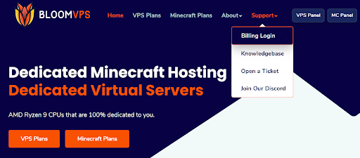
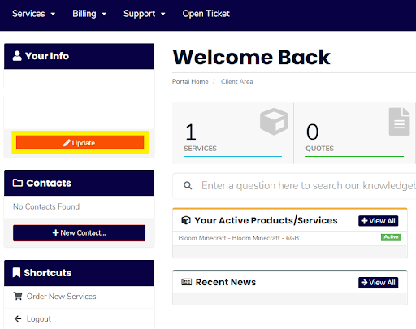
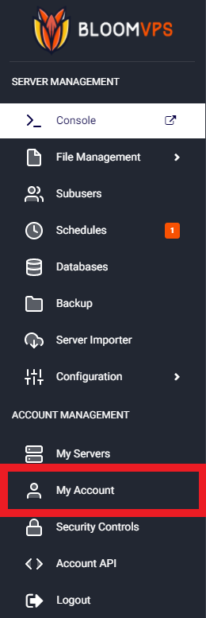
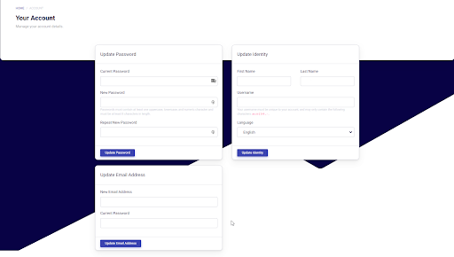

# Editing Account Details

Hello Bloomers! This guide will go over how to change your account details in your client area and minecraft panel, allowing you to change your name, email, and payment details.

## Client Area

Head on over to the billing area by going to the header, hovering over support, then clicking Billing Login. Login to your account or register an account from there. 

Now, click **Update** under Your Info. 

This area lets you edit any details about your account, from payment methods to emails sent to changing your password. Once done, click **Save Changes** for all your changes to take effect. 

## Minecraft Panel

To start, head over to your sidebar and click the My Account tab. 

Simply edit any details that you need. Once you have completed a section, click the Update button below it to apply the changes needed. 