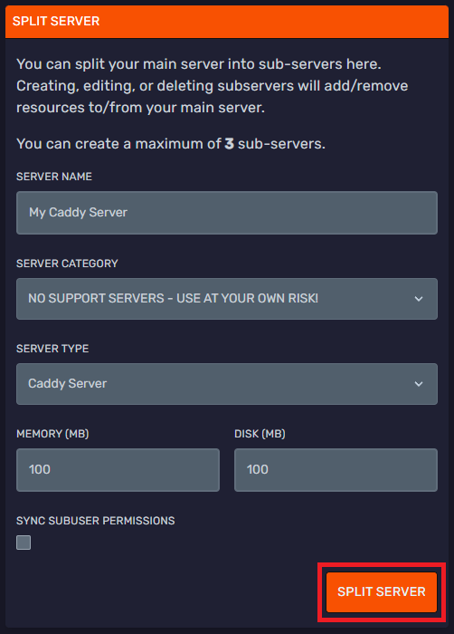

<h1>Creating a Caddy Split Server</h1>

Hello Ducklings!

This guide will create a Caddy split server on Bloom.host.

---

## Creating the split server.

Head on over to "Server Splitter" tab in your Minecraft control panel.

Now, enter a name for you server and choose "NO SUPPORT SERVERS" under "SERVER CATEGORY". Then choose "Caddy Server" under "SERVER TYPE". Set MEMORY to 100MB and DISK to how much storage your Caddy server needs. After that, press **SPLIT SERVER**.

After you press **SPLIT SERVER** confirm you would like to split your server by pressing **YES, SPLIT THIS SERVER**. This will stop your main server and create a split Caddy server.

---

## Configuring the Caddy server.

To start, drop your html/php files into the "/public" directory of the caddy server. Then start the server.
If you would like to use a domain for this server follow these [instructions](https://docs.bloom.host/ports-and-proxies/) to setup a reverse proxy.
