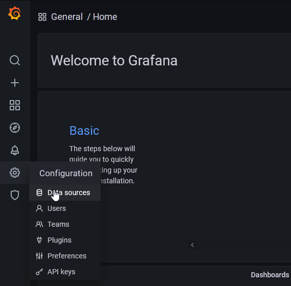
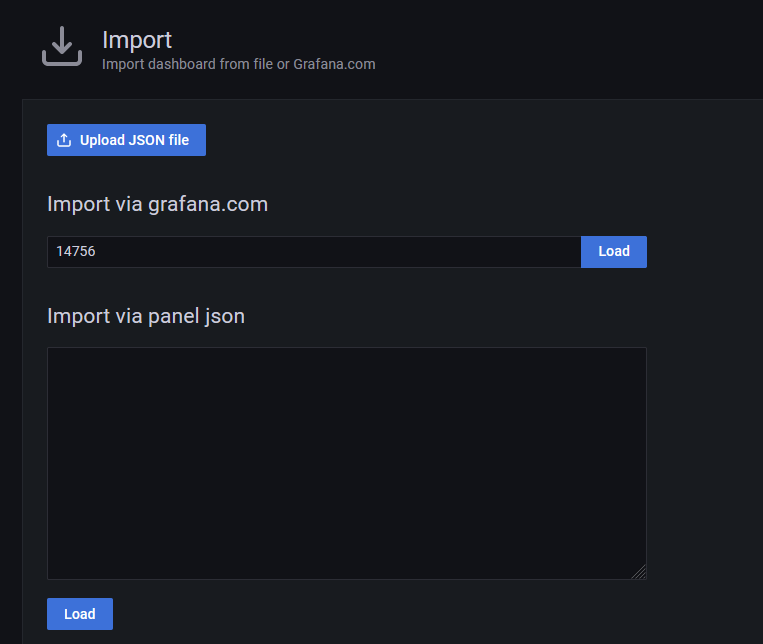
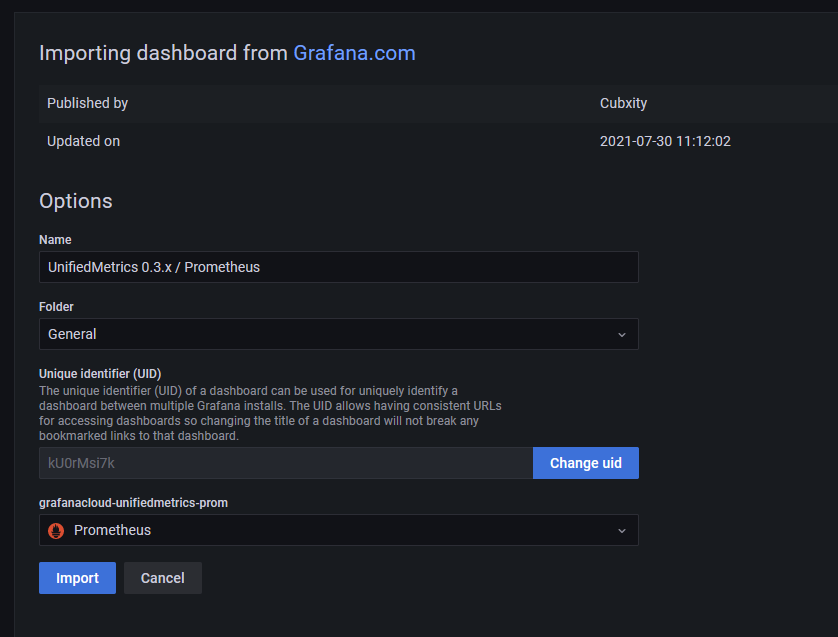

<h1>Grafana</h1>

This guide will walk you through how to setup Grafana, Prometheus, and UnifiedMetrics so you can have more stats about your minecraft server(s), which couldn't be done without our lovely server splitter :)
This guide is more complex than others as it's an advance setup, but it will allow you to see tons of cool stats about your server(s).

We'll be using 3 different software that all have their purpose.

UnifiedMetrics - Plugin that's installed on your Minecraft server that gathers the data and constantly publishes it in a Prometheus readable format.
Prometheus - The database that stores all your fancy data and reads UnifiedMetrics.
Grafana - A beautiful open source tool that allows you to interact and explore with all your data.

:::important

If you want to connect multiple servers to your Grafana dashboard you can do so by adding multiple jobs to the Prometheus server. See explanation under Multiple servers.

:::

## UnifiedMetrics

Download the plugin off the [Github](https://github.com/Cubxity/UnifiedMetrics/releases) and install it in the `plugins` folder.
For assistance on how to install plugins, please refer to the [plugin installation page](https://docs.bloom.host/installing-plugins).

Now you're gonna want to open up the default port for UnifiedMetrics (9100) under the Ports & Proxies tab.

We're now done with UnifiedMetrics, onto Prometheus :)

## Prometheus

Now we're going to setup a Prometheus server, you're gonna want to split a Prometheus instance which is located under the "NO SUPPORT SERVERS" category with 150MB of RAM and 10GB of Storage (may need to be adjusted to your needs).
For assistance on how the server splitter works, please refer to the [server splitter page](https://docs.bloom.host/split-server).

Once the server is created, change it to the default Prometheus port (9090) under the Server Split tab.

Now we're going to edit prometheus.yml and add UnifiedMetrics in the Prometheus server.

To do this, we're simply going to change `172.18.0.1` to your server's IP address, then start up prometheus.

## Grafana

Now you can use Grafana Cloud, or a self hosted instance of Grafana but in this guide we're gonna use a self hosted Grafana instance using Bloom's server splitter :)

Time to split a Grafana instance using the server splitter with 150MB of RAM and 1GB of storage (may need to be adjusted to your needs).

Once the server is created, change it to the default Grafana port (3000) under the Server Split tab.

At this point you may want to setup a reverse proxy for Grafana so it gets HTTPS and so users don't need to specify a port.

Simply follow this guide [here](https://docs.bloom.host/ports-and-proxies).

Now, head to your Grafana's IP & Port (or subdomain if you setup the reverse proxy) and login.

Default credentials
User - admin
Password - admin

Once logged in, hover over the settings icon on the left and head to Data Sources.

Now we're going to add a new Prometheus data source, the only thing you need to modify is the URL which will be `http://<SERVERIP>:9090`.

Now, Grafana has access to all the data, but where can you view all the fancy graphs?

Time to add a Dashboard made by the UnifiedMetrics team. Simply hover over the + on Grafana's main page and click import. Then enter `14756` as the ID and click load.

Then select your Prometheus data source and click Import.

And there you have it, now you can have a ton of fancy statistics for your Minecraft Server :)

