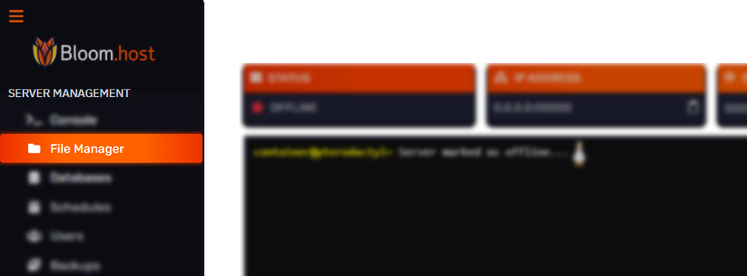
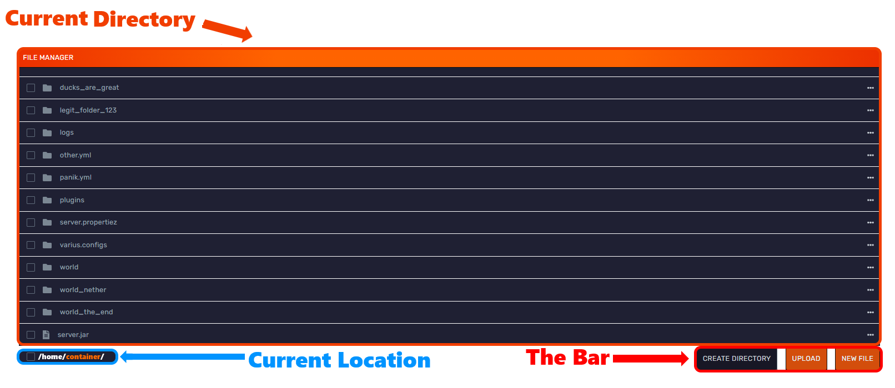

# File Manager Controls

Hey Bloomers! 👋 

In this guide, we will go over the basic controls of the file manager and how to utilize it to its fullest! Check out our next page for information about SFTP!

---

### Getting to the File Manager

To find the file manager, go to the Minecraft panel, and go to your sidebar then File Manager as shown above!

---

### What everything does

- **The blue area** shows where exactly you are in the files. So if you were to go into your plugins folder, it would change to `/home/container/plugins` - Some plugin configurations may require this!
- **The red area** is "The Bar". You can make new files, new folders, upload files, or use a mass action on several selected files or folders. 
- **The orange area** is your directory. This is the place where all your files are in. To open a file or folder, right click on it. To modify it, left click on it.
- **Right Click / Actions Area**: When you right click on a file or folder, you have several options on what to do with it, ranging from renaming through moving it to another location to deleting it. 

---