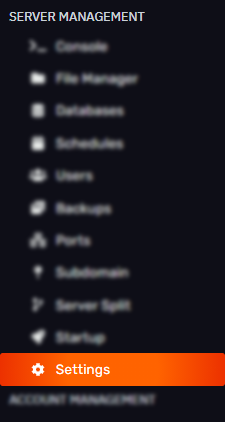
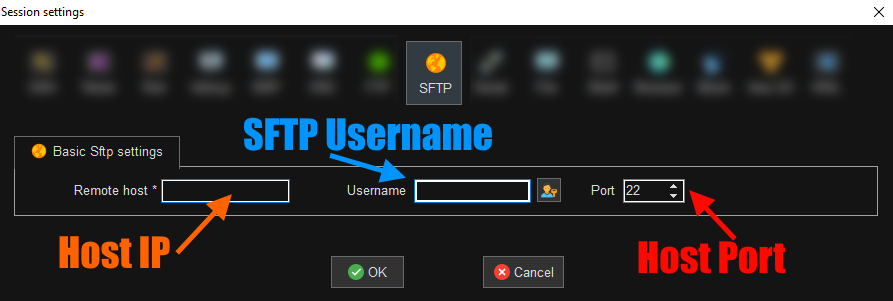

# How to use SFTP to transfer files

Hey Bloomers! In this guide we will be using SFTP to import and export files. The SFTP client we will be using is called filezilla, which you can download from [here](https://filezilla-project.org/download.php?show_all=1). 

To find the login details, navigate to the sidebar of the server, then open the file management section, and then click on “SFTP settings”, which is highlighted in yellow.

The connection address(host) is highlighted in purple, while the username that you login with is highlighted in green.The password is the same password you use to login to the panel.

After this, open up your sftp client (in this case filezilla). You input your login details in the top left, which is shown in purple.The left side contains the files stored on your computer (red), and the right(yellow) contains the files on the server. The bottom, shown in blue, gives you information on the file transfer. 
