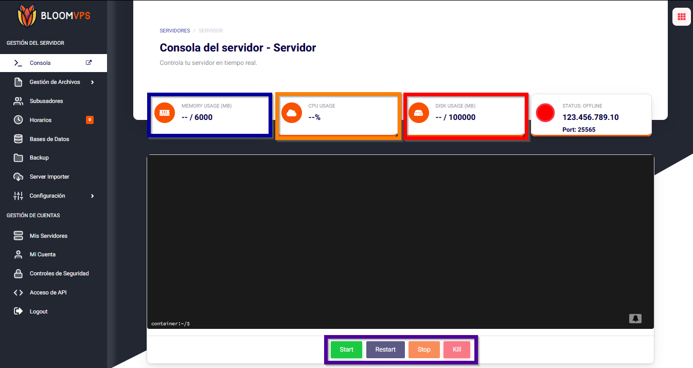
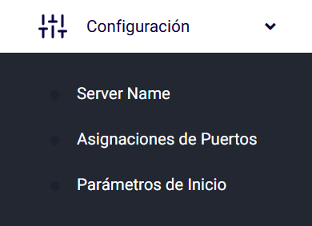

# Controles Básicos

¡Hola Bloomers! Esta guía te ayudará a entender el ambiente de tu panel y que hace cada opción.

Azul es la memoria que tu servidor está usando. Con las Aikar Flags, la mayoría del tiempo estarás usandotoda o casi toda. ¡Memoria sin usar es memoria desperdiciada!

Anaranjado es el uso de CPU entre tus dos cores. Minecraft Paper solo usará 2 cores, lo cual implica, que tener más no significa mejor rendimiento. Si aún deseas más, considera tener un VPS.

Rojo es el espacio de disco que hasusado. Plugins que almacenan mucha información como Dynmap suele usar mucho almacenamiento, así que es recomendado mantener un ojo en la cantidad de almacenamiento que te queda. Si llegas al máximo de almacenamiento, tu servidor se apagará y esperará hasta que tengas suficiente almacenamiento para iniciar de nuevo.

Gris es la consola. Aquí, puedes mandar cualquier coamdno y ver que es lo que está pasando en tu servidor. Cuando uses un comando, recuerda quitar el /. Si aun deseas usar un /, puedes usar [este plugin](https://www.spigotmc.org/resources/81157).

Morado es el menú de control de tu servidor, permitiéndote Iniciar (Start), Apagar (Stop) y Reiniciar (Restart) tu servidor. No es recomendado Abortar (Kill) el servidor puesto que los plugins y los mundos no se guardarán y se pueden corromper. Solo úsalo si el servidor deja de responder totalmente.

Amarillo es la barra lateral, la cual permite navegar entre diferentes pestañas de tu panel. Estas opciones varían desde las cuentas en tu panel hasta tus bases de datos.

 Si una pestaña tiene una flecha, es una categoría con más pestañas ocultas debajo de ella. Para ver esas pestañas, click en la categoría y se mostrarán las pestañas disponibles.
