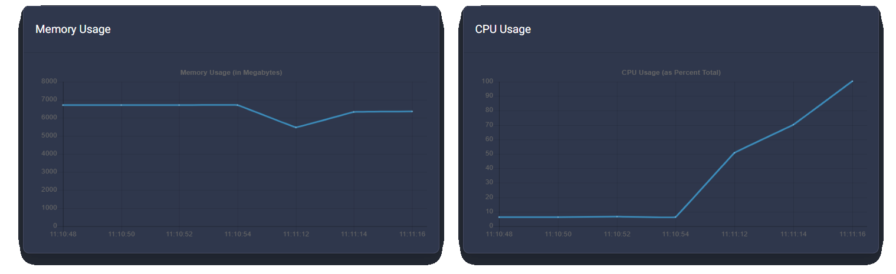

# Controles Básicos

¡Hola Bloomers! 👋

Esta guía te ayudará a entender el ambiente de tu panel y que hace cada opción.

¡Puedes acceder al panel de control de tu servidor [aquí](https://mc.bloom.host/)! - Si tienes más de un servidor, vas a tener que seleccionar el que quieres modificar.

----

### **¡Este es un ejemplo de la página principal!**

---

### **¡En la parte superior del panel puedes ver información en vivo de tu servidor!**
- Aquí puedes ver la IP pública de tu servidor, la cual se usa para conectarse al servidor (Morado) y la ID de tu servidor, la cual es crucial cuando  recibes soporte. (Azul)
- El uso de memoria es de color Verde. Con Aikar flags, estarás usando casi toda la memoria la mayoría del tiempo. ¡Memoria sin usar es memoria gastada!
- El uso de tus dos cores es de color Naranja. Minecraft Paper solo usará 2 cores, y tener más no significa necesariamente mejor rendimiento. Si deseas usar más, considera usar un VPS.
- Tu uso de espacio en disco es de color Rojo. Algunos plugins como Dynmap pueden tomar bastante espacio, asi que es recomendable echar un ojo en el uso de almacenamiento restante de vez en cuando. Si tu almacenamiento se acaba, el servidor se apagará y no iniciará de nuevo hasta que tengas espacio suficiente de nuevo.

---

### **En la parte inferior puedes ver la consola.**
Aquí, puedes mandar cualquier comando y ver que es lo que está pasando en tu servidor. Cuando uses un comando, recuerda quitar el `/`. Si aun deseas usar un `/`, puedes usar [este plugin](https://www.spigotmc.org/resources/81157).

### **¡Justo abajo de tu consola puedes ver el menú de control!**
El menú de control de tu servidor te permite Iniciar (Start), Apagar (Stop) y Reiniciar (Restart) tu servidor. No es recomendado Abortar (Kill) el servidor puesto que los plugins y mundos no se guardarán y se pueden corromper. Solo úsalo si el servidor deja de responder totalmente.

---

### **Por último, ¡Puedes ver el uso de RAM y CPU en vivo en gráficos!** 
Como se mencionó anteriormente, con Aikar flags, la RAM estará siendo usada casi en su totalidad durante la mayoría del tiempo. 

---
