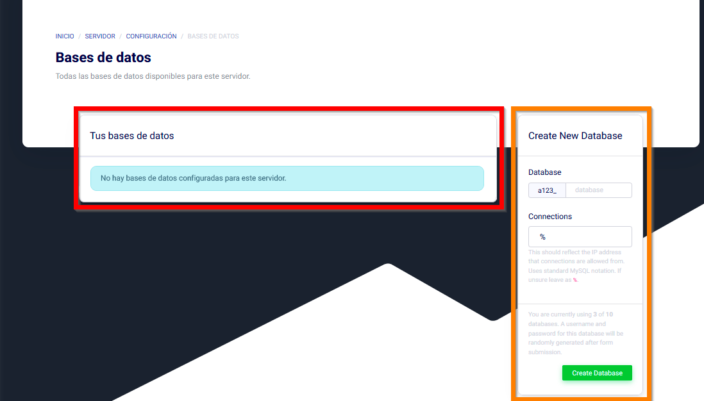
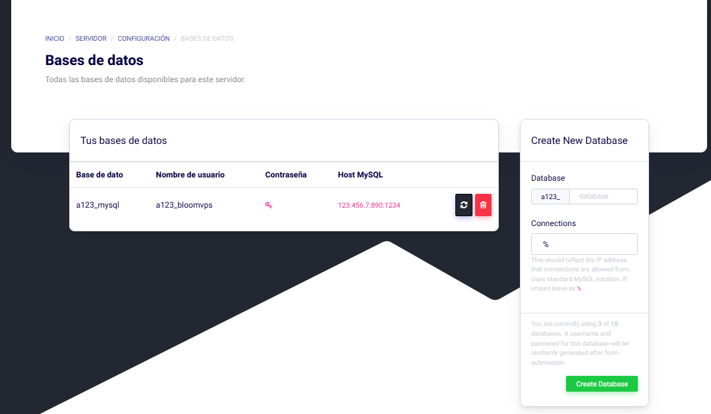

# Añadiendo Bases de datos MySQL

¡Hola Bloomers! En esta guía, repasaremos como añadir Bases de Datos MySQL para tu servidor de Minecraft.


Aquí hay 2 secciones importantes. En la roja es donde todas tus bases de datos están. Aquí es donde puedes administrar cualquier cualquier base de datos existente. En la anaranjada, puedes crear nuevas bases de datos.
En el primer recuadro, puedes asignar un nombre para tu base de datos. En el recuadro de abajo, puedes restringir conexiones MySQL. Si no planeas modificar eso, es recomendable solo dejarlo como % o poner la IP de tu servidor. En este tutorial, crearemos una base de datos. Escoje un nombre y dale a **Create Database**.


Una vez creada la base de datos, aparecerá en tu lista. Para poder usarla con plugins, simplemente copia los detalles que muestra la página hacia la configuración de los plugins. Usando esas credenciales, vamos a dar unos ejemplos.

## Ejemplos
### Luckperms:
```YAML
storage-method: MySQL

# The following block defines the settings for remote database storage methods.
#
# - You don't need to touch any of the settings here if you're using a local storage method!
# - The connection detail options are shared between all remote storage types.
data:

  # Define the address and port for the database.
  # - The standard DB engine port is used by default
  #   (MySQL: 3306, PostgreSQL: 5432, MongoDB: 27017)
  # - Specify as "host:port" if differs
  address: 168.119.0.38:3306

  # The name of the database to store LuckPerms data in.
  # - This must be created already. Don't worry about this setting if you're using MongoDB.
  database: s178_test

  # Credentials for the database.
  username: u178_uIxN5UjEZy
  password: '@CSyH7IV8r4TUnaA3A7lu^2T'
```
### LiteBans
```YAML
sql:
  # H2, MySQL, MariaDB, and PostgreSQL are supported database drivers.
  driver: MySQL

  ## MySQL/PostgreSQL settings ##
  # If using H2, the database will be stored in the LiteBans plugin folder,
  # and most of these settings won't apply.

  # Database server address.
  address: 168.119.0.38:3306

  # Database name, username and password.
  database: 's178_test'
  username: 'u178_uIxN5UjEZy'
  password: '@CSyH7IV8r4TUnaA3A7lu^2T'
```
### CoreProtect
```YAML
use-mysql: true
table-prefix: co_
mysql-host: 168.119.0.38
mysql-port: 3306
mysql-database: s178_test
mysql-username: u178_uIxN5UjEZy
mysql-password: @CSyH7IV8r4TUnaA3A7lu^2T
```
### PLAN
```YAML
Database:
    Type: MySQL
    MySQL:
        Host: 168.119.0.38
        Port: 3306
        User: u178_uIxN5UjEZy
        Password: @CSyH7IV8r4TUnaA3A7lu^2T
        Database: s178_test
        # Launch options to append after mysql driver address
        Launch_options: "?rewriteBatchedStatements=true&useSSL=false&serverTimezone=UTC"
```

¡Recuerda cambiar las credenciales con las tuyas!
