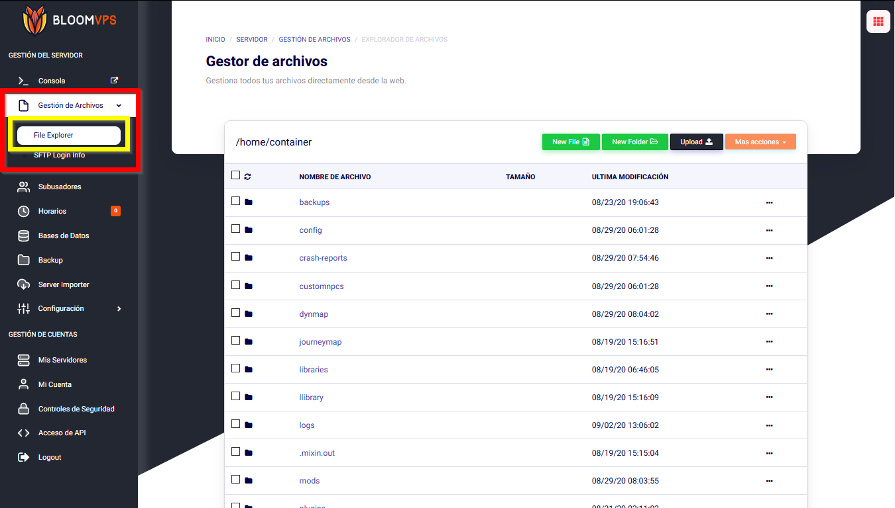
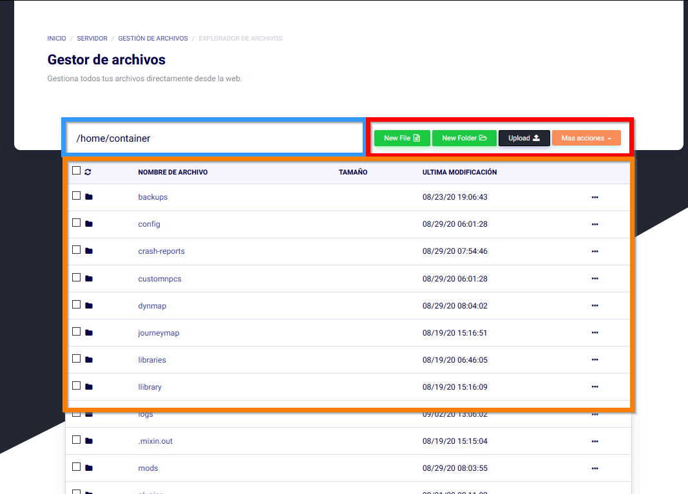
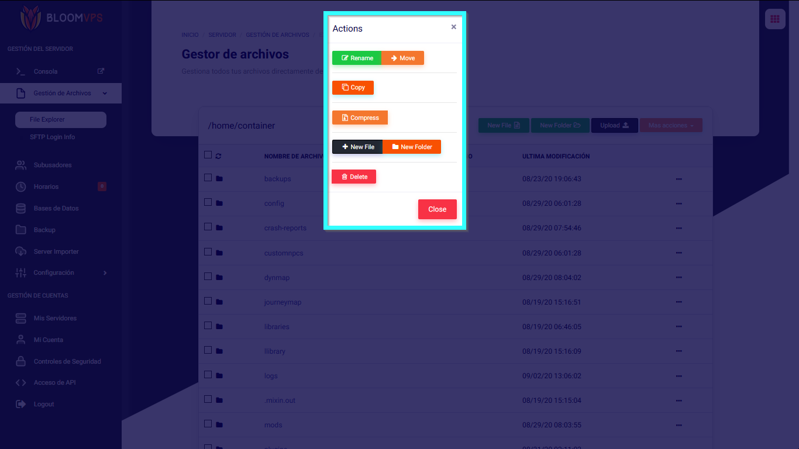

# Controles del Gestor de Archivos

¡Hola Bloomers! En esta guía, repasaremos los controles básicos del gestor de archivos y cómo usarlo por completo!

## Accediendo al Explorador de Archivos

Para encontrar el explorador de archivos, ve al panel de Minecraft, y mira la barra lateral. Click en Gestión de Archivos y luego File Explorer.

## Qué hace todo

### Área Azul
La área azul muestra donde exactamente te encuentras en tus archivos. De modo que si vas a la carpeta de plugins, cambia a /home/container/plugins
### Área Roja
La área roja es "La Barra". Puedes crear nuevos archivos, carpetas, subir archivos, o realizar acciones masivas en muchos archivos y carpetas seleccionadas. 
### Área Anaranjada
La área anaranjada es tu directorio. Este es el lugar en el cual encuentras todos tus archivos. Para abrir un archivo o una carpeta, presiona click izquierdo en él. Para modificarlo, click derecho en él.
### Click Derecho // Área de Acciones
Cuando presionas click derecho en un archivo o carpeta, aparecerán diferentes opciones disponibles, desde cambiarle de nombre a borrarlo por completo. 
