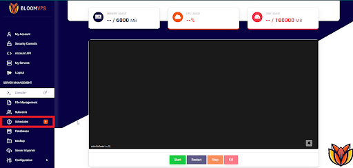
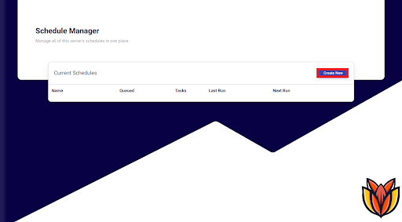
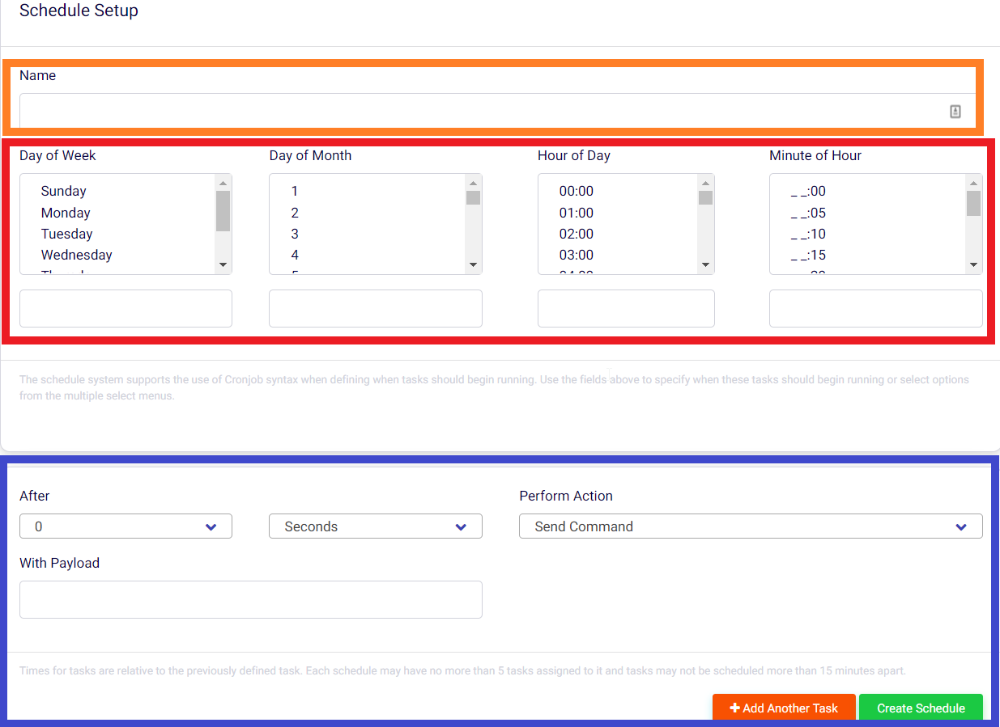

# Horarios

¡Hola Bloomers! 👋

En esta guía, repasaremos como usar el horario para preparar acciones en horas determinadas para tu servidor.

--- 

Primero, necesitas ir al panel de tu servidor y mira la barra lateral, encontrarás una sección llamada Schedules (Horarios).

 

Aquí es donde todos tus horarios se encuentran en un solo lugar. Para añadir uno nuevo, da click en el botón **Create New** (Crear Nuevo).

Aquí, vas a ingresar un nombre para tu acción y una hora válida. Básicamente, tienes que especificar qué día o qué semana de qué mes se va a activar y a qué hora. También puedes especificar acciones para cada hora y mucho más.

:::tip Tip
Sugerimos usar un [generador](https://crontab.guru/) para asegurarte que tienes el formato correcto. También toma en cuenta que todos los servidores de Bloom corren en la zona horaria UTC, así que tendrás que convertir tus horas locales a ella.
:::

Una vez terminado, click en **Create** (Crear) y ábrelo de la lista. Aquí, click en **New Task** (Nueva Acción).

La sección final es qué se va a hacer cuando llegue la hora. Puede ser un comando o una acción. Los comandos deben de ejecutarse sin el / y no aceptan variables. Puedes enviar una acción, como apagar el servidor. Las acciones disponibles son:

| Comando | Descripción                         | 
| :------ | :---------------------------------- |
| start   | Inicia el servidor                  |
| stop    | Apaga el servidor                   |
| restart | Apaga y luego inicia el servidor    |
| kill    | Mata el servidor (¡No recomendado!) |

También puedes especificar un delay (retraso). Esto es útil por ejemplo, si quieres darles a tus jugadores una advertencia 5 minutos antes de un reinicio. 

---

## Ejemplos

### • ¡Día de Lanzamiento!

### • Reinicio Diario

---