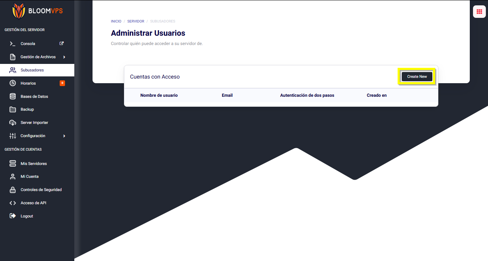
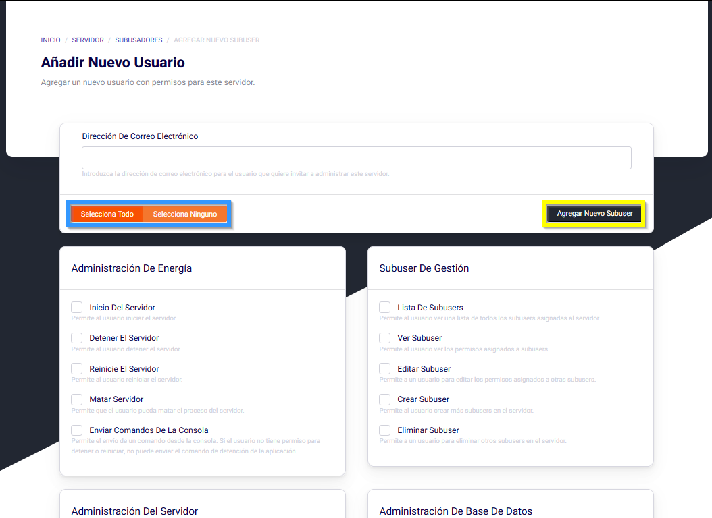

# Subusers

¡Hola Bloomers! En esta guía, repasaremos como añadir sub-usuarios a tu panel.

Dirígete a tu panel y ve a la pestaña de Subusadores en la barra de la izquierda. Ahí podrás administrar a los subusuarios. Luego, click en **Create New** para comenzar con el procedimiento. 

Una ves dentro, ingresa el email de la persona. Luego, selecciona que permisos quieres darle al usuario. En la sección resaltada de azul, puedes seleccionar todos los permisos a la vez o quitarlos todos a la vez. En la sección resaltada de amarillo, puedes añadir el subusuario, lo cual enviará el email a su correo.

Una vez has dado click en **Agregar Nuevo Subuser**, un email será enviado al que especificaste, diciéndole que ha sido invitado a tu servidor. La otra persona tiene que abrir el email recibido e ingresar al link dentro.

Una vez que el subusuario ha dado click en el link, será redirigido a la pestaña de reseteo de contraseña. Aquí pondrá su email y una contraseña para su cuenta. Una vez terminado, click en **Reset Account Password** y luego inicia sesión con las credenciales que especificaste.