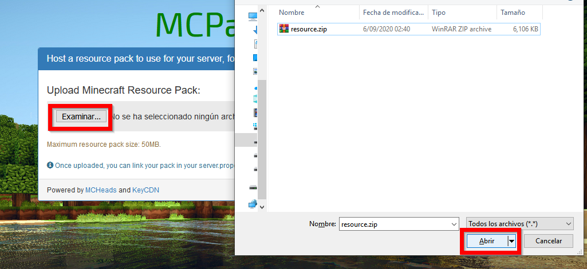
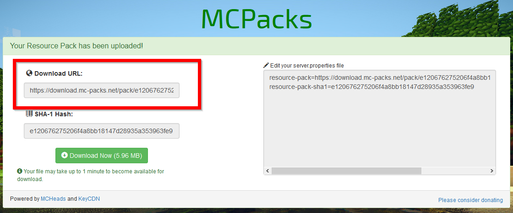
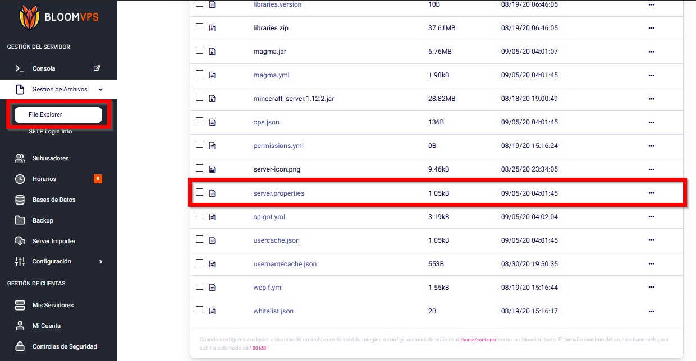
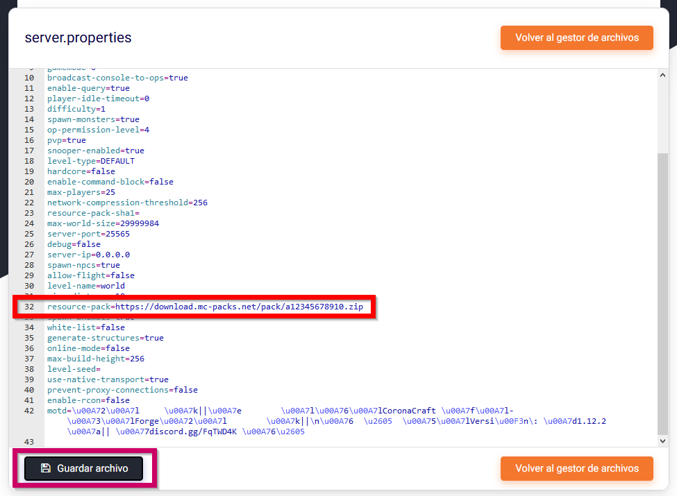

# Paquete de Recursos en Servidores

¡Hola Bloomers! En esta guía, repasaremos cómo añadir un Paquete de Recursos para todo tu servidor de Minecraft.

:::tip
El Paquete de Recursos que apliques con esta guía será instalado para todos los usuarios que se unan al servidor (asumiendo que tienen esa opción activada).
Si solo deseas usar un paquete de recursos para ti mismo, puedes usarlo de la forma convencional de Minecraft.
:::

# ¿Cómo instalar un Paquete de Recursos para servidores?

Una vez encontraste el paquete de recursos que deseas en tu servidor, necesitarás subirlo a un sitio web y obtener el link de descarga directa. Puedes usar [este sitio web](https://mc-packs.net/).  

Click en **Examinar**, encuentra tu archivo y súbelo. Asegúrate que es un archivo .zip. Puedes crear un archivo zip en base a una carpeta presionando Click Derecho, "Enviar A" y "Carpeta comprimida (en zip)". 

Presiona el botón **Upload** y espera a que termine el proceso. Una vez terminado, fíjate en el recuadro de **Download URL** y guarda el URL que aparezca debajo.

  

Ahora entra al Explorador de Archivos de tu servidor y abre el archivo `server.properties`.

  

Busca la línea que inicia con **resource-pack=** y pega el URL. Guarda el archivo después.

  

Reinicia el servidor y ya debería estar aplicado. No olvides de aceptar la confirmación que aparezca al entrar al servidor. Siéntete libre de abrir un ticket en el [Discord de BloomVPS](https://discord.gg/bloom) si necesitas ayuda.
