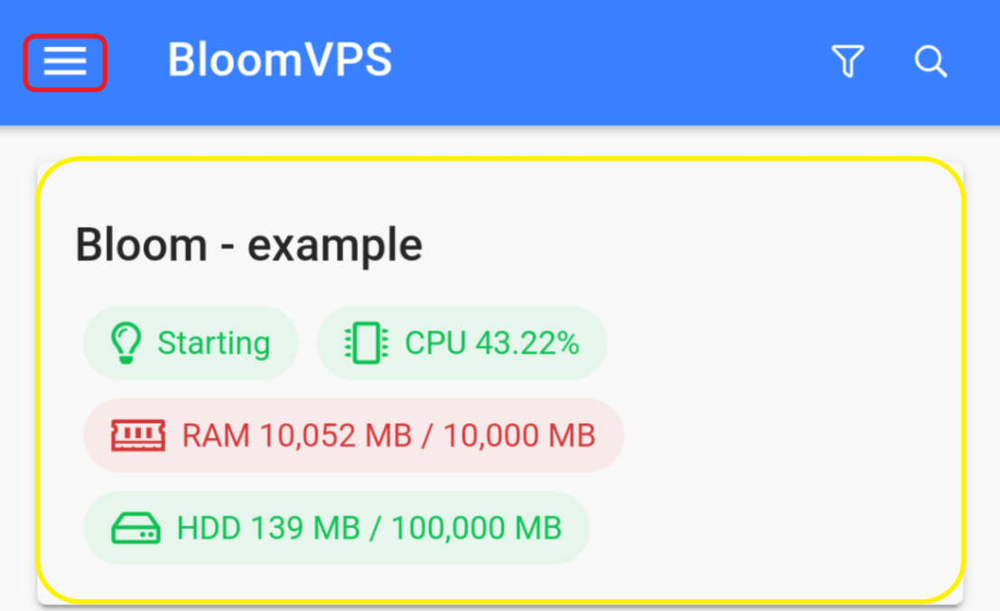

# Pterodactyl Mobile App

Hey bloomers! In this guide, we will be going over the mobile application. This allows you to manage your server from a mobile device. To download the pterodactyl mobile app, head to the [app store](https://apps.apple.com/us/app/pterodactyl-mobile/id1465354373), or the [play store](https://play.google.com/store/apps/details?id=io.pterodactyl.app&hl=en_US).

Once downloaded, put **mc.bloomvps.com** for the server url (as shown in red), and your panel login details for the other two options(as shown in yellow).

TThe hamburger menu on the top left corner lets you access the settings (hint: dark mode), while clicking on the server will bring you to the server menu. 

Clicking on the power button in the top left allows you to perform actions like stopping and starting the server, while the center area (highlighted in yellow) gives you information about the server. Towards the bottom, you can navigate to the file manager and console. To return to the main menu, you can use the hamburger menu, which is located at the top left. 
