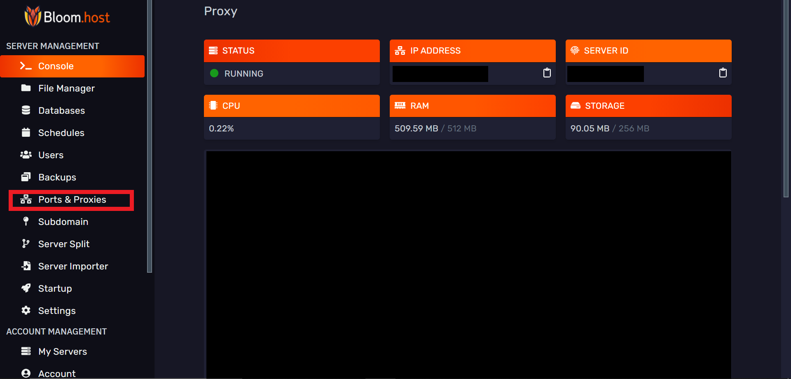

# Opening ports

You can open additional ports for your Minecraft server. For example, plugins that run web servers such as [Dynmap](https://docs.bloom.host/server-mods/bukkit-plugins/dynmap) require an additional port to run the web interface.

To open ports for your server you can do this by following these instructions:

1. From the [game panel](https://mc.bloom.host/), navigate your server and select the 'Ports & Proxies' option.

2. From the page that appears, select 'Create new allocation'.

3. Enter the port number that you want to open.

4. The port that you opened can now be used in your plugins. Please check the plugin documentation for instructions on how to do this.