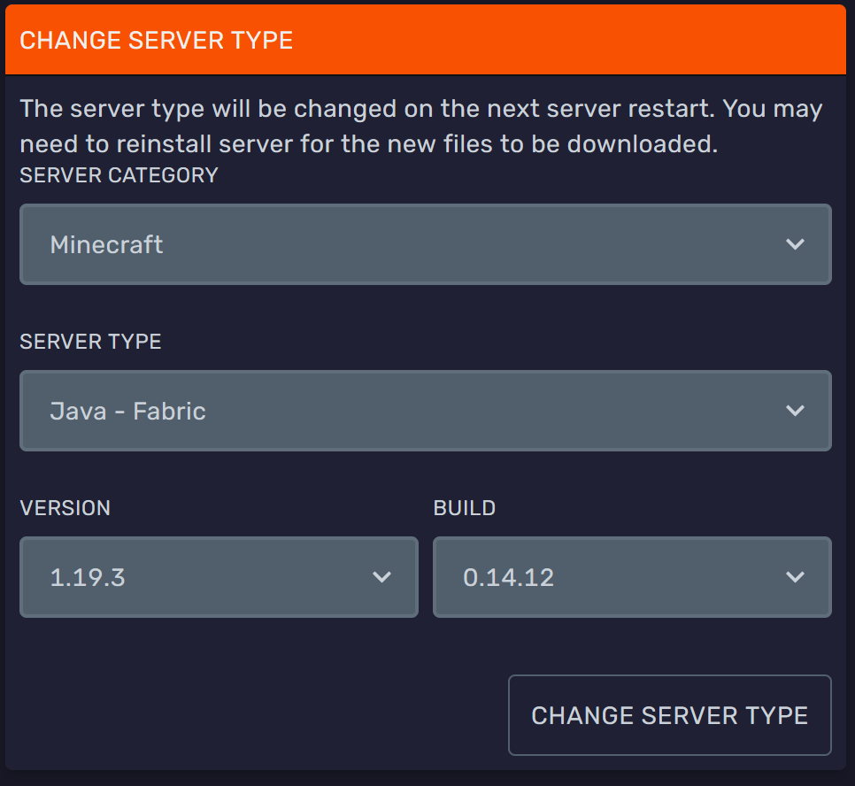

<h1>Setting Up Fabric</h1>

# Setting Up Fabric

### What is Fabric?
> "*Fabric is a lightweight, experimental modding toolchain for Minecraft.*"
> 
> Mods can be used to modify, remove or even add new content to Minecraft.

### Installing Fabric
> Go to [fabricmc.net](https://fabricmc.net/use/?page=server) and download the installer.  
> Run the Fabric Installer jar you downloaded, select the Server tab and select the Minecraft Version you want. 
>
> **NOTE** You need to click **show snapshots** if you want it to also show fabric for minecraft snapshots.
>
> 

> Click install, this will download a *fabric-server-launch.jar*, it will also show you a button for *Download server jar*, press that one too.
>
> 

> You can now close the fabric launcher, you should have a `fabric-server-launch.jar` and a `server.jar` file.  
> Upload those files to the root of your bloom server.  
> Go to the Startup tab of the [Duck Panel](https://mc.bloom.host/) and set **Server Jar File** to `fabric-server-launch.jar`  
> Restart your server and let the files generate. This may take a few minutes. 

> You are now done, you are running a fabric server!  
> It's a server without mods though, so it's still purely vanilla at this point, keep reading to learn how to install mods.

### Installing Fabric Mods
> 
> Refer to [this](fabric-mods) guide.

---