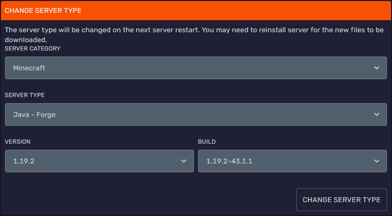
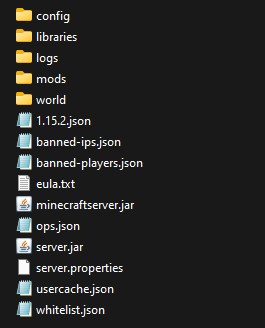

<h1>Setting Up Forge</h1>

### What is Forge?
> Forge is a modding API for Minecraft. Users who download and install Minecraft Forge can install mods (modifications) to their Minecraft Instance.
>
### Installing Forge
> To begin installing Forge, head over to their [website](http://files.minecraftforge.net/) to download their installer and launch the jar file. Have it open up in an empty directory and hit install server. Have something like the screenshot below.
>
> 

After you have installed it, head over to an [SFTP client](https://docs.bloom.host/how-to-use-sftp) such as FileZilla and upload everything inside your folder to your server.

Next, rename your forge-xxx.jar file to server.jar. The file name must match the Server Jar File field in the Startup tab.

Then, create a new folder called `mods`. Place any jars of mods you want in here.

Restart your server. This may take a few minutes. 

Once the restarted, login to your server!

In the end, it should look like this: 

### Installing Forge Mods 
> 
> Refer to [this](forge-mods) guide.

---
