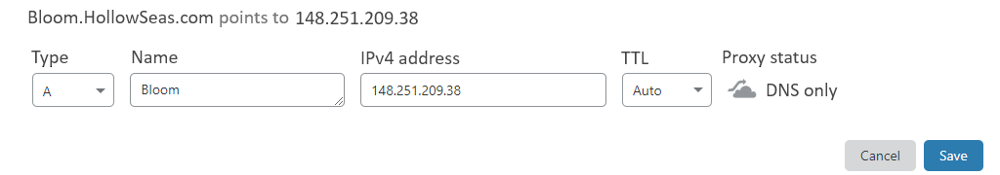
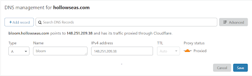

# Pointing A Domain

Hello there Bloomers! In this guide, we will go over on how to make your server go from lots of numbers (148.251.209.38:25565) to a domain name (Bloom.HollowSeas.com).

First, go to **Your Servers** and under connection, find your IP. All bloom servers come with a dedicated IP, so you only need the IP and not any of the ports (25565). 

Next, go to your domain provider. This will be different depending on what domain you have. In this case, we are going to go with CloudFlare. Go to your DNS and click add record. For a Minecraft server, we will be going with an A record.

For the name, it will bloom. This is the subdomain which we have assigned to it, so whatever name we put there will be put before the domain when we type it in. In this case, bloom.hollowseas.com. If you put play instead of bloom, it would be play.hollowseas.com. We will then put into the IP we got from our server before into the IPv4 address. Click Save. This process will now take up to 48 hours to apply, but in most cases, it will be under 24 hours. 
