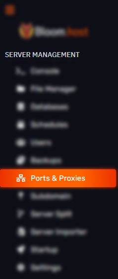
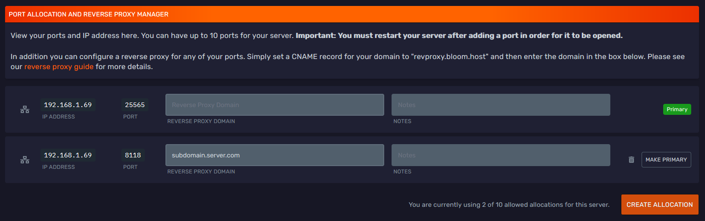

# Creating a Reverse Proxy

Hey there Bloomers! 👋

In this guide, we will go over how to create a reverse proxy for your Minecraft server!

---

:::note
For this guide, you must have access to a domain and the ability to alter that domain's DNS settings. For this guide, we assume you have a domain with Cloudflare, but most registrars will work.
:::

First, go to your [game panel](https://mc.bloom.host/) and on the left sidebar, select 'Ports & Proxies'.

More than likely, you will have one allocation, but to create a reverse proxy, you will need to create a new allocation, to do so, just click 'Create Allocation'.

Once your new allocation has been created, it will be assigned a random port, if you need a specific port, open a support ticket in the [Bloom.host Discord](https://discord.com/invite/bloom).

With this new allocation, you will want to input the domain along with the subdomain you want the reverse proxy to be directed to into the 'Reverse Proxy Domain' field. In this demo, we will use **subdomain.server.com** as our reverse proxy domain.

Now, you will want to head over to your domain's DNS settings panel, in this demo, we will be using Cloudflare.

The DNS record required for a reverse proxy is a CNAME (canonical name). You will want to create an identical CNAME record as the one pictured above, but you will replace the 'Name' field with the subdomain you entered into the 'Reverse Proxy Domain' field in the game panel.

:::warn
If you do use Cloudflare for DNS, make sure to set the 'Proxy status' as **DNS only** as it won't work if it's proxied.
:::

---