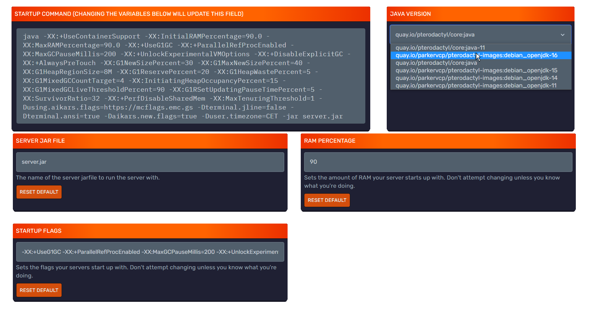

<h1>Updating To 1.19</h1>

### Introduction

Minecraft 1.19 - The Wild Update has been released!

With every update it takes a while for softwares such as Spigot, Paper and forks of it to update and support all the changes. Unfortunately it's not possible to have a set ETA for 1.19 support but you can keep track of updates on [SpigotMC.org](https://www.spigotmc.org) or on  [PaperMC's GitHub](https://github.com/PaperMC/Paper/issues/7780)!

Moving forward the game will use Java's latest release, Java 17.

---

### Precautions
A new version of the game with loads of new content also means potential new exploits and issues.
- Before updating be sure to create and test a backup of your entire server. Downgrading a world without causing corruption is near impossible.
- Moreover, if you aren't utilizing our [completely free and automatic backup feature](../using_the_panel/backups.md), we would highly suggest you set that up before updating.
- Once you update to 1.19 you can't go back to any previous version, unless you reset your worlds or restore a backup that was made when the server was on the previous version.

:::important

Starting with Paper 1.19.3 build 405, changes made to the plugin loader means that setups with cyclic plugin dependencies (where plugin loading causes a loading loop which will cycle back to the original plugin) will no longer function. A server with plugin dependency loops will not load and will be shut down with an error.

See the [Paper help page](https://docs.papermc.io/paper/reference/paper-plugins#cyclic-plugin-loading) for information on how to resolve the issue.

From Paper 1.19.3 build 425, the server will not stop on cyclic dependencies for Bukkit/Spigot plugins.
:::

---

### Updating The Jar using Bloom's Server Type System - How to update your server
Once your desired server jar supports 1.19, simply follow these steps to update:
- Make sure that your server is backed up completely.
- [Create full backup](../using_the_panel/backups.md) of your server. (As an additional step, we would suggest testing this backup on a local or a split test server)
- Go to the Settings section of the Minecraft Panel and under the Change Server Type section click on the "Update" button.
- If there's no update button you can choose the server type (Jar) you want to use, then on version select 1.19 and click on Change Egg then click on Reinstall Now. Do note that not all server jars have updated to support 1.19, so 1.19 will not appear on the list until the server jar is updated. 

---

### Updating The Jar Manually
Once your desired server jar supports 1.19, simply follow these steps to update:
- Make sure that your server is backed up completely.
- [Create full backup](../using_the_panel/backups.md) of your server. (As an additional step, we would suggest testing this backup on a local or a split test server)
- Remove your current server jar through [SFTP](../using_the_panel/sftp.md) or the [File Manager](../using_the_panel/file-manager-controls.md).
- Download the new version of your server software. If you are unsure which one to use, check out our guide on server jars [here](jars.md).
- Upload it using SFTP or the File Manager and make sure to define the full name (such as `paper-1.19-023` in the 'Startup' tab on the panel)

---

### Changing To Java 17

:::important
If you are unable to change this next setting and you see a message such as "This server's Docker image has been manually set by an administrator and cannot be changed through this UI.", please [open a ticket on the support Discord.](https://discord.com/invite/bloom) and Bloom.host staff will need to change this for you.
:::

1. Firstly you want to go to the [Minecraft server control panel](https://mc.bloom.host/) and select the server that you want to change the Java version of.
2. On the left side, select 'Startup'.
3. Next, find the Java Version tab (usually on the top right of the page) 
4. Select the `Java 17` option!
5. Start your server back up!

