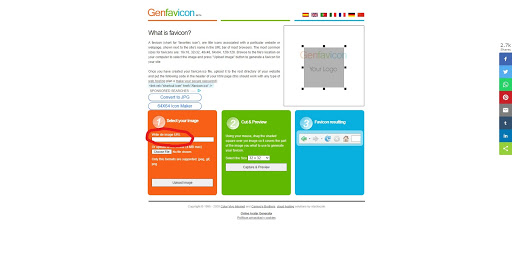
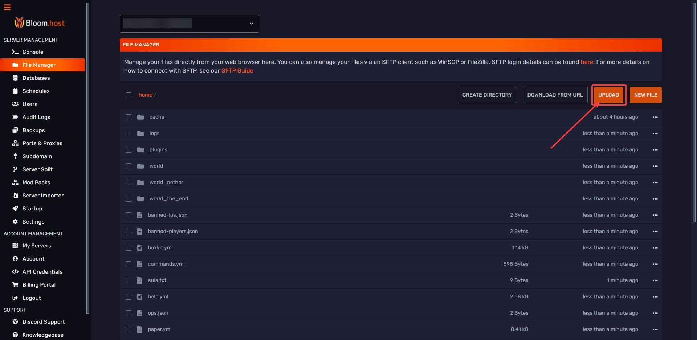

<h1>Adding an icon to your server</h1>

# Adding an icon to your server.

Grab the picture you want to use and head over to http://www.genfavicon.com/

Paste the image URL link or click choose a file to import a photo from your computer.
Then click on the “Upload Image” button.

Your image should pop up in the upper right-hand corner as seen below

You will then need to click and drag the little boxes to fit the part of the image you want to include.

When you’re satisfied with the selection head down to the green box that says “cut and preview”. Under this heading, you should select a size in the dropdown menu. select 64x64 then click capture and preview.

After clicking you should then get an option saying “download png” click on this and save the file as “server-icon.png”. 

Now go to your server and open “file management” then open “file explorer” in the dropdown menu.

Click upload and pick the icon you made, make sure you name the file exactly server-icon.png or this will not work.

Now, restart your server. Feel free to open a ticket if you need any assistance. 

