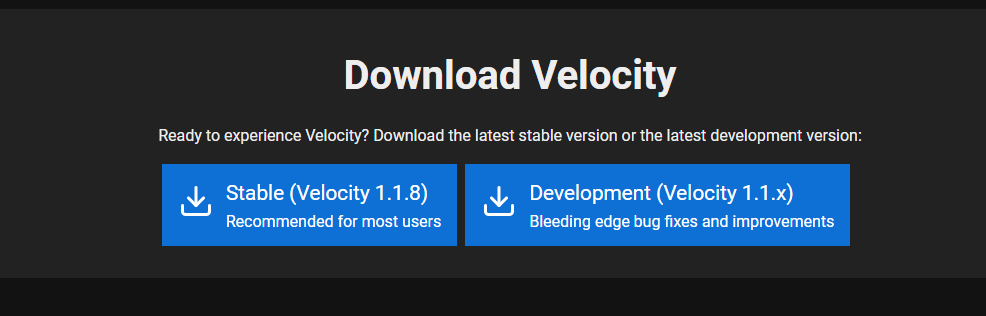
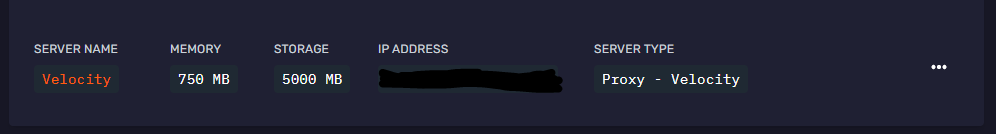
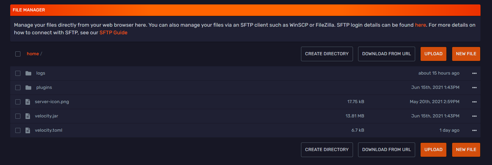

<div class="text--center">

<h1>Setting Up Velocity</h1>
</div>

:::important

When running your servers behind a proxy like Velocity or Waterfall, it requires them to be set to offline-mode. Normally hosting companies will not provide support for offline mode servers, but in this case it is required for the proxy to function properly. It will act as the gateway to your servers and handle authentication for you.

:::

## Downloading Velocity

To get started with Velocity, you first need to download the latest version of Velocity from their [downloads page](https://velocitypowered.com/downloads). It is recommended that you go with the stable version that they provide to ensure the most stability when it is running.



Once you have downloaded Velocity you may proceed to the next step in the setup process: creating a server split to run Velocity off of. Velocity is it’s own server jar file and will require it’s own server to run from.

## Creating a Velocity Server Split

:::note

It is recommended that you give Velocity at least 524 to 750 megabytes of RAM to operate off of, for servers with a lot of traffic it is probably better to allocate 1 gigabyte of RAM for Velocity to ensure a smooth experience for your users.

:::

First you will need to head to your server split section via the server panel sidebar, the button should look like this.


Next you need to select the type of server split you want to create, name your split, and allocate the amount of RAM and Storage you want your Velocity Server to have, it will look something like this:


After you create your split for Velocity it will appear in that section with all its details, just like your other server splits.



Rename your velocity jar that you downloaded in the previous section to `velocity.jar` for simplicity and upload it to your `/home` directory on your new server split. This will be the jar that runs Velocity, much like server jars on your other splits. After you've uploaded the jar file to your server you need to head to the `Startup` section of your server split via the sidebar and make sure that the name of the startup variable for the server jar matches up with what you have uploaded. It should look like this:


Now you need to start up the Velocity server and then shut it down once it's loaded, this will initialize the filesystem for Velocity and setup Velocity's folders and configuration file. Your `/home` directory should now look something like this.



The `velocity.toml` file is the config file for Velocity, we will be editing this and more in the following sections.

## Setting up the [servers] section in velocity.toml

The first section of the config file you need to edit is the `[servers]` section, this will contain the aliases you want to use for your different servers in the config as well as the IP Addresses/Ports of the servers so that Velocity knows how to connect players to servers running behind the proxy. Here is an example `[servers]` section provided from Velocity's documentation.

:::note

Before you setup this section, change the primary port for your backend servers to something other than 25565. 25565 is the default minecraft port and should be reserved for your Velocity server as it is what players are actually connecting to when they try and connect to your network.

:::

```
[servers]
# Configure your servers here. Each key represents the server's name, and the value
# represents the IP address of the server to connect to.
lobby = "127.0.0.1:30066"
factions = "127.0.0.1:30067"
minigames = "127.0.0.1:30068"

# In what order we should try servers when a player logs in or is kicked from a server.
try = [
  "lobby"
]
```

The `try` section you see in the above example is extremely important, essentially this is the order of servers in which Velocity will try to connect incoming players to. If you have it setup like `try = ["survival", "creative", "minigames"]` then players will connect to `survival` by default, then `creative` if `survival` is down, and then `minigames` if the first two are down. Setup your preferred order and then we will continue our editing.

## Configuring server.properties on your backend servers

In the `/home` directory of the servers you are running behind Velocity, you need to go to `server.properties` and set `online-mode` to `false`. For Velocity to work correctly and communicate with your backend servers it needs to be turned off. 

Remember that running your server in offline mode is not supported by Bloom.host normally, but in the case of setting up a proxy like Velocity or Waterfall you need to do so for the proxy to work so it is acceptable. 

After you configure and save your `server.properties` file along with completing the next section on Player Information Forwarding, make sure to `restart` your backend servers so that the changes are applied.

## Configuring Player Information Forwarding


:::warning

It is HIGHLY recommended that your Velocity server is set to online-mode, this is the most secure option for running your server and will reduce hackers and exploits by a ton simply by having it turned on. You can also visit [Velocity’s documentation](https://velocitypowered.com/wiki/users/forwarding/) for more setup help, but it highly recommended that you use modern forwarding.

:::

Part of what makes Velocity more secure than Bungee would be it's modern player information forwarding mode, it is much more secure than Bungee and doesn't require an additional plugin such as BungeeGuard to secure connections between your front-end and back-end servers. This is pretty simple to setup, you need to locate the option for `player-info-forwarding` inside `velocity.toml` and set it to `modern`. Next you need to perform additional steps depending on the type of server jar that you're running behind Velocity.

### Modern Forwarding for Paper

:::note

This section also applies to forks based upon Paper such as Purpur or Airplane

:::

`Paper 1.14+` and above, along with `Paper 1.13.1/1.13.2 build 377` and above support Velocity modern forwarding natively.

First, you need to disable BungeeCord forwarding if you had it enabled beforehand. Make sure `settings.bungeecord` is set to `false` in your `spigot.yml`.

In `paper.yml`, set `settings.velocity-support.enabled` to `true` and `settings.velocity-support.secret` to match the secret in your `velocity.toml`. You must also set `settings.velocity-support.online-mode` to the `online-mode` setting in your `velocity.toml`. Once you're done editing `paper.yml`, reboot your server.

### Modern Forwarding for Fabric

A mod called [FabricProxy-Lite](https://www.curseforge.com/minecraft/mc-mods/fabricproxy-lite) allows you to use Velocity modern forwarding with a modded server using Fabric.

### BungeeGuard Forwarding for Spigot/Paper

:::caution
Legacy BungeeCord forwarding mode is less secure than modern Velocity forwarding mode and may result in security issues if not setup properly. 

If you need to use legacy BungeeCord forwarding mode, make sure you setup BungeeGuard to ensure people do not connect directly to your backend servers.

Note that the `bungeeguard` forwarding mode uses legacy BungeeCord forwarding with the `forwarding-secret` as the BungeeGuard token.
:::

:::note
This section also applies to forks based upon Paper such as Purpur or Airplane
:::

If you cannot use modern forwarding (for example, your server jar doesn’t support Velocity modern forwarding), you might be able to use BungeeGuard instead.

To set this up, see the guide [on how to set up BungeeGuard](/docs/plugins_and_modifications/multiplatform/bungeeguard.md).


## Additional configuation options for velocity.toml

The following table contains additional noteworthy configuration options for `velocity.toml`

| Option | Description | Example    |
| -------- | --------- | ---------- |
| **[forced-hosts]**  | This lets you setup your custom domain with velocity, set the right side up to match your **try** section from earlier | `"host.name" = ["lobby", "survival", "creative"]` |
| **show-max-players** | The max player count that displays in the multiplayer menu | `show-max-players: 100` |
| **forwarding-secret**| Do not change this. This is the secret you need to insert into configuration files on your backend servers | `forwarding-secret: "someRandomStringHere"` |
| **bind** | This is the default IP address that players will connect to when connecting to Velocity, it's recommended to set it like the example here so that it uses Minecraft’s default port | `bind: "0.0.0.0:25565"`|

You can find documentation for other settings in the `velocity.toml` file [right here](https://velocitypowered.com/wiki/users/configuration/)!

## Finishing up

Now that you have configured your backend servers to communicate with Velocity correctly you are ready to start Velocity. Start your Velocity Server and make sure that you have restarted all of your backend servers and you should now have a working Velocity network!

If you are interested in installing additional functionality for Velocity, they have a `Plugins` section [on their website](https://forums.velocitypowered.com/c/plugins/5) where you can go to find Velocity compatible plugins!

:::tip

The server-icon.png file you upload to your Velocity server is the icon that will show up on the multiplayer menu in Minecraft.

:::


