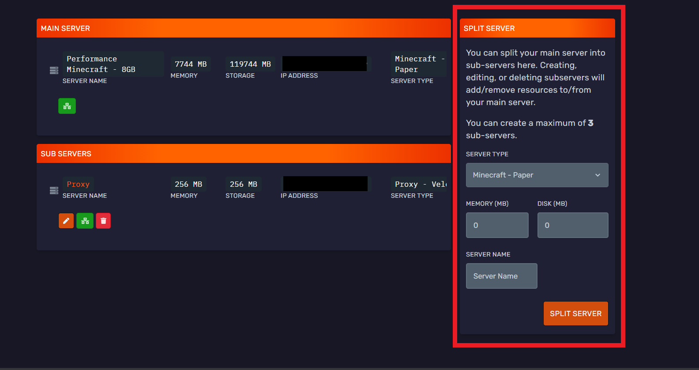

# Splitting your server 

Bloom.host allows you to split the server that you have with them, for example to run more Minecraft servers for different gamemodes or to run a Discord bot off of your server.

:::important
Splitting your server will use resources (Disk space and RAM) from your main server. It's important to make sure that you leave enough resources so that your main server runs properly!
:::

## Split your server

Firstly from the [game panel](https://mc.bloom.host/), navigate your server and select the 'Server split' option.

Secondly, in the box on the right (highlighted with a red border), there are several options there for selecting the type of server and the amount of resources that you want to give to the split server. For example, if you wanted to make a seperate (not modded) server for a new gamemode, select `Minecraft - Paper` as the server type and enter the amount of RAM and disk storage space you want to allocate for your server.

Click on `Split server` and you will see a window confirming wether you want to continue with the server split.

:::caution
Your main server will be stopped by splitting your server as resources will be taken from it to make your new server.
:::

Click on `confirm` and your server will be split. Success! You have successfully split your server.

You can interact and manage this new server in the same way as you would with your main server.

When you login to the game panel, you can see your new server in the list of servers you can manage.

