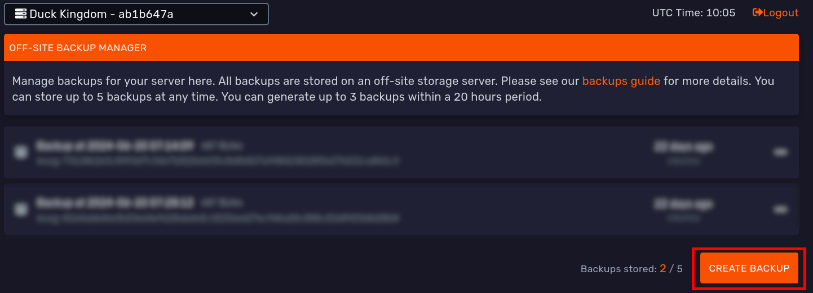
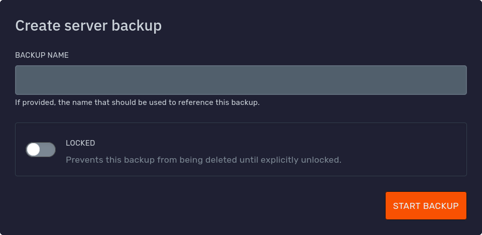

// Todo (notgeri): a link that allows you to add your server ID to go to it
// Todo (notgeri): remove old images
// Todo (notgeri): 
- quick restore
- full restore
- mount
- delete
- get download/download
- ignore
- pro backup addon

## Introduction

Game services come with our free user-managed off-site incremental backup system.

This means, after the first backup, it will only save and upload the files which were changed since the last backup.

All backups are stored off-site for security!

You can create manual and even automatic backups and later [restore](#restoring-backups), [download](#downloading-backups), [mount](#mounting-backups) or [delete](#deleting-backups) them.

[MySQL databases](../databases) are also [backed up](#mysql-databases), as long as they are under 1 GB in size.

| Plan                                    | Max Stored Backups | Max Backups Per Day |
|-----------------------------------------|--------------------|---------------------|
| Essentials                              | 3                  | 3                   |
| Performance                             | 5                  | 3                   |
| Performance Plus                        | 10                 | 3                   |
| ✅ [Pro Backup Addon](#pro-backup-addon) | Base plan + 10     | 8                   |

// Todo (notgeri): update
<iframe width="560" height="315" src="https://www.youtube.com/embed/KnzimsqhwQs?si=NZM1oLrhgWiOqu4P" title="YouTube video player" frameborder="0" allow="accelerometer; autoplay; clipboard-write; encrypted-media; gyroscope; picture-in-picture; web-share" referrerpolicy="strict-origin-when-cross-origin" allowfullscreen></iframe>

---

## Manual Backup Creation

To create a manual backup, head over to the 'Backups' tab of the panel.

Here you will find your current backups, and a **Create Backup** button.

When you click it, you will get this screen where you can give it an optional name and whether to [lock it](#locking):

When you are ready, press the 'Start Backup' button to continue. 

The backup then will start in the background, this may take some time depending on the size of your server.

---

### Setting Up Automatic Backups

1. Head over to the Schedules tab on the panel.
2. We are going to add a schedule that starts a backup, but these schedules can do way more! Find some examples
   at [Schedules](schedules.md). Simply click 'Create Schedule'.
3. Select when you wish to have a backup and click 'Create Schedule'. In this case we do one every 8 hours using all 3
   daily backups.
   
4. Then, simply add the action "Create Backup" on a task.
   

Keep in mind that you can you can generate up to 3 backups within a 24 hours period.

**Essentials** plans can store a maximum of **3** backups.
**Performance** plans can store a maximum of **5** backups.
**Performance+** plans can store a maximum of **10** backups.

If you have reached the backup limit, the oldest backup will be rotated.

---

### Restoring Backups

To restore a backup, simply head to the backups page, select the backup and click 'Restore'. Do note, this will
overwrite any files with matching names.

---

### Mounting Backups

In case you only require a limited number of files from a backup, you can 'mount' it to your server. While a backup is
mounted, you will not be able to stop or start your server nor create a new backup.

To mount a backup:

1. Head over to the backups page
2. On the right side, click other options
3. Click 'Mount', select the folder or leave it as default and click 'Mount Backup' to confirm.
4. Head over to 'File Manager' and you should be able to view a new folder with all the files from that backup!

### How to restore specific files/folders

You can restore specific files from a backup by mounting it. Once you have mounted the backup, you can go to the file
you want to restore. click on the `...` at the right of the file, and click on restore. This will restore the file to
its original directory.

## MySQL Databases
[MySQL databases](../databases) under 1 GB are automatically added to backups. 

When you [restore](#restoring-backups) or [mount](#mounting-backups) a backup, you can find them as [SQL dumps](https://en.wikipedia.org/wiki/Database_dump) in a special `backup_db/` directory:

You can use the 'Import to database' button in the '...' menu to re-import them to a new database.

---

## Locking

Locking a backup will prevent it from being automatically rotated by [schedules](#automatic-backup-creation) or accidentally [deleted by users](#deleting-backups).

You can lock a backup when [creating one manually](#manual-backup-creation) or by pressing the '...' menu on its right
side and using the 'Lock' button:

Locked backups show a yellow padlock 🔒:

Locked backups can be unlocked the same way with the 'Unlocked' button.

---

## Ignoring Files

:::caution HEADS UP!
This is for advanced users only. If you are unsure how to use this, please reach out to our support for help.
:::

If you do not want certain files to be backed up, you can create a special `.bloomignore` file in the main
folder of your game server.

This uses a very similar format as a commonly used [.gitignore](https://git-scm.com/docs/gitignore).

This will **not** remove it from any existing backups.

---
