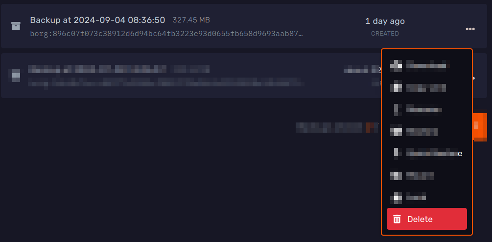

// Todo (notgeri): a link that allows you to add your server ID to go to it, like for the schedule ?template=backup
// Todo (notgeri): remove old images
// Todo (notgeri): update video
// Todo (notgeri):
- quick restore
- full restore
- mount

## Introduction

Game services come with our free user-managed off-site incremental backup system.

This means, after the first backup, it will only save and upload the files which were changed since the last backup.

All backups are stored off-site for security!

You can create manual and even automatic backups and
later [restore](#restoring-full-backups), [download](#downloading-backups), [mount](#mounting-backups)
or [delete](#deleting-backups) them.

[MySQL databases](../databases) are also [backed up](#mysql-databases), as long as they are under 1 GB in size.

| Plan                                    | Max Stored Backups | Max Backups Per Day |
|-----------------------------------------|--------------------|---------------------|
| Essentials                              | 3                  | 3                   |
| Performance                             | 5                  | 3                   |
| Performance Plus                        | 10                 | 3                   |
| ✅ [Pro Backup Addon](#pro-backup-addon) | Base plan + 10     | 8                   |

<iframe width="560" height="315" src="https://www.youtube.com/embed/KnzimsqhwQs?si=NZM1oLrhgWiOqu4P" title="YouTube video player" frameborder="0" allow="accelerometer; autoplay; clipboard-write; encrypted-media; gyroscope; picture-in-picture; web-share" referrerpolicy="strict-origin-when-cross-origin" allowfullscreen></iframe>

---

## Manual Backup Creation

To create a manual backup, head over to the 'Backups' tab of the panel.

Here you will find your current backups, and a **Create Backup** button.

When you click it, you will get this screen where you can give it an optional name and whether to [lock it](#locking):

When you are ready, press the 'Start Backup' button to continue.

The backup then will start in the background, this may take some time depending on the size of your server.

---

## Automatic Backup Creation

You can utilise our [schedule feature](../schedules) to automatically generate backups.

First, open the 'Schedules' tab of the panel. Here, click the 'Templates' button in the bottom right corner:

Lastly, click 'Create' next to the 'Daily Restart' template:

Once created, you can access the schedule in the same place:

You can edit this templated schedule like any other! Please refer to our [schedules guide](../schedules).

:::caution HEADS UP!
If there are no free slots available, the oldest backup will automatically be deleted before a new one is created unless
you [lock the backup](#locking).
:::

If you would like more frequent backups, you can subscribe to the [Pro Backup Addon](#pro-backup-addon).

---

## Restoring Full Backups

To restore a backup, simply head to the backups page, select the backup and click 'Restore'. Do note, this will
overwrite any files with matching names.

---

## Mounting Backups

In case you only require a limited number of files from a backup, you can also 'mount' it to your server.

The mounted backup is accessible as any other folder through the '[File Manager](../file-manager-controls)' tab and [SFTP](../sftp).

:::caution HEADS UP!
While a backup is mounted, you will **not be able to start the server or modify other backups**.  
If you need to quickly restore some files that you know exist in a backup, you can use the 
**[quick restore feature](#quick-restoring-backups)** instead. 
:::

To mount a backup, first head over to the 'Backups' tab and locate the backup you wish to mount.  
In its '...' context menu, click the 'Mount' button: 

You can set a specific folder to mount it to or leave it on default to mount it to the `backup` folder
// Todo (notgeri): fix that modal and add a pic here

After confirming, wait until the backup shows up as mounted. This may take a few minutes at most:

You can use the 'View' button in its '...' context menu to navigate to the mounted folder:

// Currently doing: mount copy/restore features, finish this ^ 

---

## Downloading Backups

If you are looking to download an entire backup, there are a few ways to do this.

### Through Your Browser

The simplest way is to download the file through your browser.

To do this, press the 'Download' button in the '...' context menu of the backup and you will automatically be redirected
to download the backup.

Your browser may report an unknown amount of time for the download, since it's not possible to calculate the size of the
exported backup without downloading it first. This is expected!

### Through A Direct Download Link

If you need a direct download link, such as for command line tools like `curl` or `wget`, you can use the 'Copy Link'
button in the '...' context menu of the backup.

:::caution HEADS UP!
Direct download links allow **anyone** to download this backup, so make sure to keep the link safe and private.
The link automatically expires after 15 minutes and can only be used once.
:::

### Using ClumsyLoader

You can find out more in [our dedicated guide](../../extras/clumsyloader)!

---

## MySQL Databases

[MySQL databases](../databases) under 1 GB are automatically added to backups.

When you [restore](#restoring-full-backups) or [mount](#mounting-backups) a backup, you can find them
as [SQL dumps](https://en.wikipedia.org/wiki/Database_dump) in a special `backup_db/` directory:

You can use the 'Import to database' button in the '...' context menu to re-import them to a new database.

---

## Deleting Backups

If you no longer need a specific backup, you can delete it with the 'Delete' button in the '...' context menu.

:::warning HEADS UP!
This is a completely irreversible action. Deleted backups cannot be recovered by any means.
:::

---

## Locking

Locking a backup will prevent it from being automatically rotated by [schedules](#automatic-backup-creation) or
accidentally [deleted by users](#deleting-backups).

You can lock a backup when [creating one manually](#manual-backup-creation) or by pressing the '...' context menu on its
right
side and using the 'Lock' button:

Locked backups show a yellow padlock 🔒:

Locked backups can be unlocked the same way with the 'Unlocked' button.

---

## Ignoring Files

:::caution HEADS UP!
This is for advanced users only. If you are unsure how to use this, please reach out to our support for help.
:::

If you do not want certain files to be backed up, you can create a special `.bloomignore` file in the main
folder of your game server.

This uses a very similar format as a commonly used [.gitignore](https://git-scm.com/docs/gitignore).

This will **not** remove it from any existing backups.

---

## Pro Backup Addon

This is a recurring paid addon for your server which allows you to create **8 backups per day** and store an **additional
10 backups total**.

These changes apply to all [server splits](../split-server) in the same plan!

It costs $5/mo and can be cancelled at any time.

### For New Plans
Select the 'Upgraded' option in 'Pro Backup Addon' at the last step of the checkout:

### For Existing Plans
1. Head over to the [billing area](https://billing.bloom.host) and click 'Manage' next to your plan:
  
2. Click the 'Upgrade/Downgrade **Options**' button:
  
3. Lastly, ensure the 'New Configuration' for the 'Pro Backup Addon' is set to 'Upgraded' and check out as usual:
  
