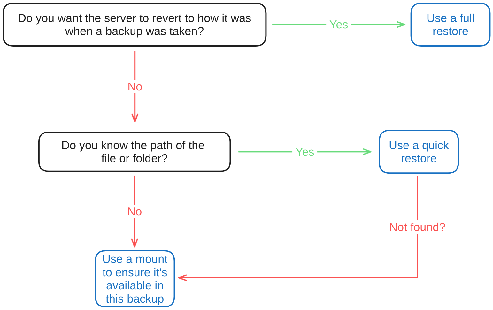
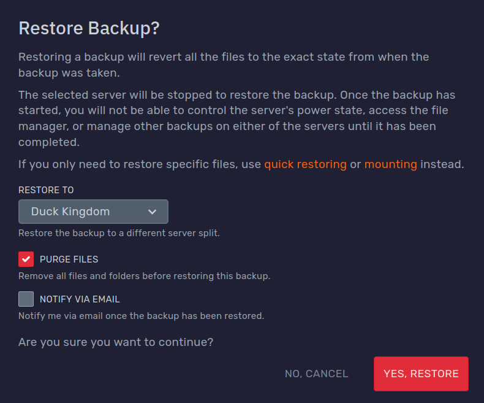
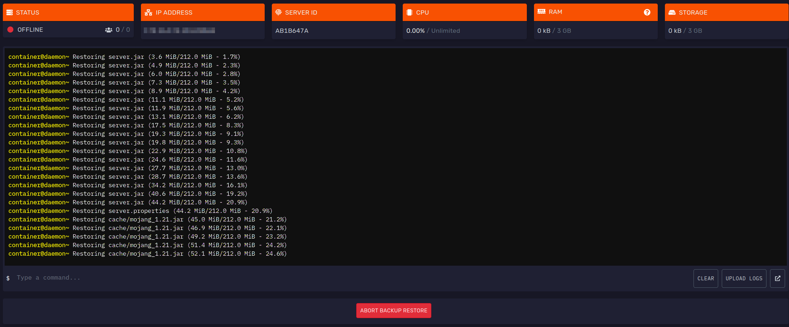
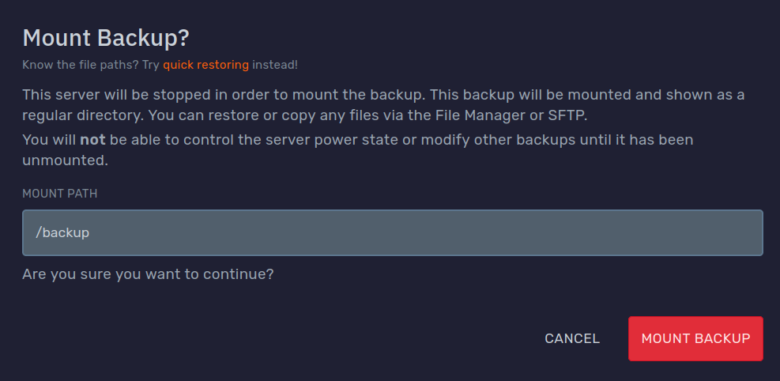

## Introduction

Game services come with our free user-managed off-site incremental backup system.

This means, after the first backup, it will only save and upload the files which were changed since the last backup.

All backups are stored off-site for security!

You can create manual and even automatic backups and
later [restore](#restoring-full-backups), [download](#downloading-backups), [mount](#mounting-backups)
or [delete](#deleting-backups) them.

[MySQL databases](../databases) are also [backed up](#mysql-databases), as long as they are under 1 GB in size.

Most actions require the backup repository to be locked, so certain actions cannot be done concurrently.
You will see a conflict warning in the DuckPanel when this happens.

| Plan                                    | Max Stored Backups | Max Backups Per Day |
|-----------------------------------------|--------------------|---------------------|
| Essentials                              | 3                  | 3                   |
| Performance                             | 5                  | 3                   |
| Performance Plus                        | 10                 | 3                   |
| ✅ [Pro Backup Addon](#pro-backup-addon) | Base plan + 10     | 8                   |

---

## Manual Backup Creation

To create a manual backup, head over to the 'Backups' tab of the panel.

Here you will find your current backups, and a **Create Backup** button.

When you click it, you will get this screen where you can give it an optional name and whether to [lock it](#locking):

When you are ready, press the 'Start Backup' button to continue.

The backup then will start in the background, this may take some time depending on the size of your server.

If you changed your mind, you can use the 'Abort' button to prevent the backup from completing.

---

## Automatic Backup Creation

You can utilise our [schedule feature](../schedules) to automatically generate backups.

First, open the 'Schedules' tab of the panel. Here, click the 'Templates' button in the bottom right corner:

Lastly, click 'Create' next to the 'Daily Restart' template:

Once created, you can access the schedule in the same place:

You can edit this templated schedule like any other! Please refer to our [schedules guide](../schedules).

:::caution HEADS UP!
If there are no free slots available, the oldest backup will automatically be [deleted](#deleting-backups) before a new
one is created unless you [lock the backup](#locking).
:::

If you would like more frequent backups, you can subscribe to the [Pro Backup Addon](#pro-backup-addon).

---

## File Restoration Options

[Mounting](#mounting-backups), [restoring](#restoring-full-backups) and [quick restoring](#quick-restoring-backups) are
all similar and serve to restore specific files from a backup, but when to use them will depend on the task at hand.

Here is a flowchart to make the choice easier:

---

## Restoring Full Backups

:::caution HEADS UP!
This will restore **ALL** files from the backup. Any conflicting files will be overwritten.

If you need to quickly restore some files that you know exist in a backup, you can use the
**[quick restore feature](#quick-restoring-backups)** or **[mounting](#mounting-backups)** instead.
:::

To restore a backup, head to the 'Backups' and use the 'Restore' option in the context menu of whichever
backup you would like to restore.

You can restore the backup to any [server split](../split-server) you have access to.

Additionally, you can choose whether to delete all files first which will return the files exactly
how they were when the backup was created.

Optionally, you can also ask to be notified via email when the backup has been restored.

Once started, you will be redirected to the 'Console' tab of the selected server where you can monitor the progress of
the restoration.

You can also use the 'Abort' button to cancel the restoration:

---

## Quick Restoring Backups

In case you know that certain files or folders exist within a backup, you can use our quick restore feature, which does
not require the server to be offline.

If the files you want to roll back exist in the current state of the server, you can select them
in the [File Manager](../file-manager-controls) tab and use the 'Restore' option to initialise
a new quick restore session:

The following menu consists of 3 steps. You can navigate by clicking the step icon or with your arrow keys:

1. **Backup selection**: You can select which backup to restore from. Only complete backups can be used:

   

2. **Path selection**: Here you will see all the paths that you selected before.  
   You can use the text area to enter a list of custom paths, one path per line. Use the '+' button to add the paths.

   By default, all paths are restored to their original location, overwriting any existing paths.  
   You can select a different restoration path or even [server split](../split-server) at the bottom of the page.

   

3. **Options**: You can choose whether to stop the server to ensure restored files will not be overwritten by the
   running server.

   Additionally, you can choose to delete paths that are found in the backup. As an example, if you are restoring the
   `world/playerdata/` folder, this option will delete the folder to ensure any player data files that were not in the
   the backup will not linger after the restoration.

   

Once the quick restore is started, you will be redirected to its status page.

Depending on what needs to be restored, this process may take anywhere from a few seconds to several minutes. You can
view the live status of each task here.

If you allow the DuckPanel to send notifications through your browser, you can leave the browser tab in the background
and you will be notified when all tasks are done.

You can abort specific tasks or the entire restoration at any point.

Any files that could not be found in the backup will show their status as such.

### Dismissing

All active quick restores can be found in the 'Backups' tab:

If you no longer need their results, you can dismiss them with the ✅ or the dismiss button.

---

## Mounting Backups

In case you only require a limited number of files from a backup, you can also 'mount' it to your server.

The mounted backup is accessible as any other folder through the '[File Manager](../file-manager-controls)' tab
and [SFTP](../sftp).

:::caution HEADS UP!
While a backup is mounted, you will **not be able to do the following actions**:

- Start the server
- Modify or create backups
- Search, create or edit existing files
- Calculate file and directory sizes

If you need to quickly restore some files that you know exist in a backup, you can use the
**[quick restore feature](#quick-restoring-backups)** instead.
:::

To mount a backup, first head over to the 'Backups' tab and locate the backup you wish to mount.  
In its context menu, click the 'Mount' button:

You can set a specific folder to mount it to or leave it on default to mount it to the `/backup` folder:

After confirming, wait until the backup shows up as mounted. This may take a few minutes at most:

You can use the 'View' button in its context menu to navigate to the mounted folder:

You can also find it in the main folder of your File Manager:

Similarly, you can use [SFTP](../sftp) to access this special folder.

### Restoring & Copying Mounted Files

You can select or right click any file or folder to either restore or copy them.

Restoring automatically moves them to their original path. For example, restoring `backup/plugins/Chunky/` will restore
it to `plugins/Chunky/`.

Copying works as it does by default, and you can even copy the files to a different server split.

Note that extracting may take significantly longer than a regular copy, since it's done over the network.

### Unmounting

Once you are done, you can unmount the backup by right clicking the backup in the 'Backups' tab or the folder in
the 'File Manager' tab.

---

## Downloading Backups

If you are looking to download an entire backup, there are a few ways to do this.

### Through Your Browser

The simplest way is to download the file through your browser.

To do this, press the 'Download' button in the context menu of the backup and you will automatically be redirected
to download the backup.

Your browser may report an unknown amount of time for the download, since it's not possible to calculate the size of the
exported backup without downloading it first. This is expected!

### Through A Direct Download Link

If you need a direct download link, such as for command line tools like `curl` or `wget`, you can use the 'Copy Link'
button in the context menu of the backup.

:::caution HEADS UP!
Direct download links allow **anyone** to download this backup, so make sure to keep the link safe and private.
The link automatically expires after 15 minutes and can only be used once.
:::

### Using ClumsyLoader

You can find out more in [our dedicated guide](../../extras/clumsyloader)!

---

## MySQL Databases

[MySQL databases](../databases) under 1 GB are automatically added to backups.

When you [restore](#restoring-full-backups) or [mount](#mounting-backups) a backup, you can find them
as [SQL dumps](https://en.wikipedia.org/wiki/Database_dump) in a special `backup_db/` directory:

You can use the 'Import to database' button in the context menu to re-import them to a new database.

---

## Deleting Backups

If you no longer need a specific backup, you can delete it with the 'Delete' button in the context menu.

Note that the backup has to be unlocked for this.

:::warning HEADS UP!
This is a completely irreversible action. Deleted backups cannot be recovered by any means.
:::

The oldest [unlocked](#locking) backup is deleted automatically when a [scheduled backups](#automatic-backup-creation)
is generated as well.

---

## Locking

Locking a backup will prevent it from being automatically rotated by [schedules](#automatic-backup-creation) or
accidentally [deleted by users](#deleting-backups).

You can lock a backup when [creating one manually](#manual-backup-creation) or by pressing the context menu on its
right
side and using the 'Lock' button:

Locked backups show a yellow padlock 🔒:

Locked backups can be unlocked the same way with the 'Unlocked' button.

---

## Ignoring Files

:::caution HEADS UP!
This is for advanced users only. If you are unsure how to use this, please reach out to our support for help.
:::

If you do not want certain files to be backed up, you can create a special `.bloomignore` file in the main
folder of your game server.

This uses a very similar format as a commonly used [.gitignore](https://git-scm.com/docs/gitignore).

This will **not** remove it from any existing backups.

---

## Pro Backup Addon

This is a recurring paid addon for your server which allows you to create **8 backups per day** and store an
**additional 10 backups**.

These changes apply to all [server splits](../split-server) in the same plan!

It costs $5/mo and can be cancelled at any time.

### For New Plans

Select the 'Upgraded' option in 'Pro Backup Addon' at the last step of the checkout:

### For Existing Plans

1. Head over to the [billing area](https://billing.bloom.host) and click 'Manage' next to your plan:
   
2. Click the 'Upgrade/Downgrade **Options**' button:
   
3. Lastly, ensure the 'New Configuration' for the 'Pro Backup Addon' is set to 'Upgraded' and check out as usual:
   
